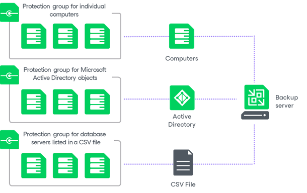

# Protection Group Types

In this article

Veeam Backup & Replication offers several methods to specify computers on which you want to install and manage Veeam Plug-Ins.

|  |
| --- |
| Tip |
| If you plan to back up MongoDB replica sets, you must use a protection group for applications. For details, see [Protection Group for MongoDB](mongo_protection_group_hiw.md). Other protection group types are not supported for MongoDB. |

You can create protection groups that include the following types of objects:

* Individual computers

You can organize individual computers into a protection group by specifying the necessary computers in the protection group settings. This option is recommended for smaller environments that do not have Microsoft Active Directory deployed.

* Microsoft Active Directory objects

You can create protection groups that include one or more Microsoft Active Directory objects: entire domain, container, organization unit, group, computer or cluster. This allows you to manage Veeam Plug-Ins on computers being part of an Active Directory domain. Protection groups that include Active Directory domain, containers, groups and organization units are dynamic in their nature. For example, if a new computer is added to a container, Veeam Backup & Replication will automatically discover this computer and start managing this computer as specified in the protection group settings.

You can specify a protection scope based on Active Directory objects in one of the following ways:

* You can select individual Active Directory objects that you want to include in a protection group, for example, selected organization units and computers.
* You can include in the protection group an entire domain or other Active Directory object (such as a container or organization unit) and exclude specific child objects being part of this object, for example, selected organization units and computers.

* Computers listed in a CSV file

You can add multiple computers to a protection group by importing a list of computers from a CSV file. Protection groups that include computers listed in a CSV file are also dynamic. If a new computer appears in a CSV file after the protection group is created, during the next protection group rescan session, Veeam Backup & Replication will automatically update the protection group settings to include the added computer.

Page updated 9/16/2025

Page content applies to build 13.0.1.1071
