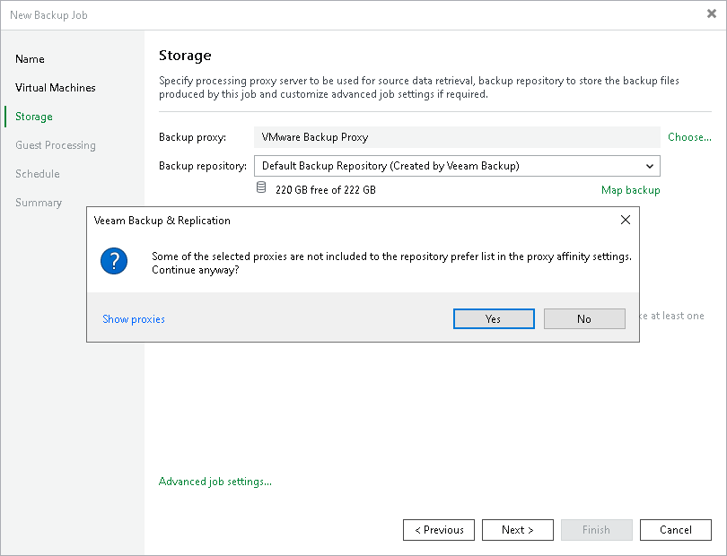

# Proxy Affinity

In this article

|  |
| --- |
| Important |
| Proxy affinity settings are not applicable in Microsoft Hyper-V environments. |

By default, Veeam Backup & Replication assigns backup proxies and repositories for jobs or tasks independently of each other. If you need to bind backup proxies to specific backup repositories and use them together, you can define proxy affinity settings. Proxy affinity determines what backup proxies are eligible to access a specific backup repository and read/write data from/to this backup repository.

Proxy affinity lets you control assignment of resources in the backup infrastructure and reduce administration overhead. For example, in case of a geographically distributed infrastructure, you can restrict a backup repository in the local site from communicating with backup proxies in a remote site. Or you can configure proxy affinity rules based on a connection speed between backup proxies and backup repositories.

Proxy affinity settings are specified at the level of a backup repository. By default, Veeam Backup & Replication lets all backup proxies in the backup infrastructure access the backup repository. Using proxy affinity settings, you can define a list of backup proxies that can access this backup repository.

Proxy affinity can be set up for the following types of backup repositories:

* Backup repositories
* Scale-out backup repositories
* Cloud repositories (proxy affinity settings are configured on the tenant side)

Proxy affinity rules are applied to the following types of jobs and tasks that engage backup proxies and repositories:

* Backup jobs, including VMware Cloud Director backup and backup jobs from storage snapshots on primary and target storage arrays
* VeeamZIP
* VM copy
* Entire VM restore
* Hard disk restore

Proxy affinity rules are not applied to replication jobs.

Proxy affinity rules are not restrictive. You can think of affinity rules as a priority list. If backup proxies from the proxy affinity list cannot be used for some reason, for example, these backup proxies are inaccessible, Veeam Backup & Replication automatically fails over to the regular processing mode. It picks the most appropriate backup proxy from the list of proxies selected for the job or task and records this action in the [job statistics](realtime_statistics.md).

When you target a job at a backup repository for which proxy affinity settings are configured, you must make sure that you assign a backup proxy from the proxy affinity list for job or task processing. If you assign a backup proxy that is not bound to this backup repository, Veeam Backup & Replication will display a warning. For job processing, Veeam Backup & Replication will use the backup proxy that you define in the job settings, which may result in degraded job performance.

Proxy Affinity for Scale-Out Backup Repositories

In case of a scale-out backup repository, you can configure proxy affinity settings at the extent level. Proxy affinity settings cannot be configured at the scale-out backup repository level.

Extent selection rules have a higher priority than proxy affinity rules. Veeam Backup & Replication first selects an extent and then picks a backup proxy according to the proxy affinity rules specified for this extent.

For example, you have 2 backup proxies: Backup Proxy 1 and Backup Proxy 2. You create a backup job and target it at a scale-out backup repository configured in the following way:

* Scale-out backup repository policy is set to Data Locality.
* Scale-out backup repository has 2 extents: Extent 1 has 100 GB of free space and is bound to Backup Proxy 1; Extent 2 has 1 TB of free space and is bound to Backup Proxy 2.

In the backup job settings, you define that Backup Proxy 1 must be used for job processing.

When you run the backup job, Veeam Backup & Replication will store backup files to Extent 2 since it has more free space. For job processing, it will pick Backup Proxy 1 and will display a message in the job statistics that requirements of proxy affinity rules cannot be met.

In case of restore from a scale-out backup repository, backup files may be located on different extents. In this case, Veeam Backup & Replication picks a backup proxy according to the following priority rules (starting from the most preferable one):

1. Backup proxy is added to the affinity list for all extents.
2. Backup proxy is added to the affinity list for the extent where the full backup file is stored.
3. Backup proxy is added to the affinity list for at least one extent.

Related Topics

[Specifying Proxy Affinity Settings](proxy_affinity_settings.md)

Page updated 9/15/2025

Page content applies to build 13.0.1.1071
