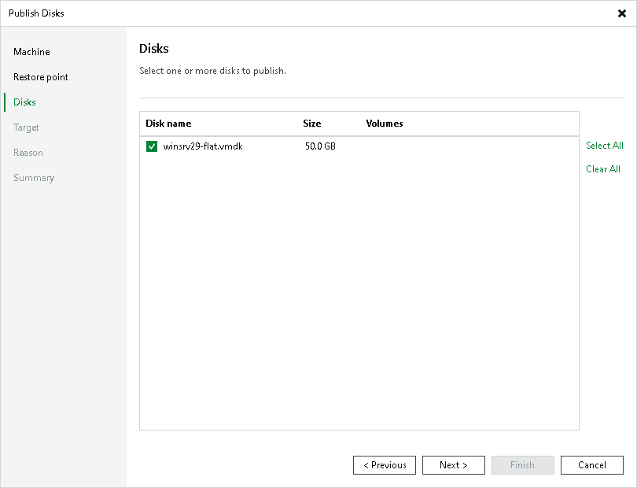

# Step 4. Select Disks

In this article

At the Disks step of the wizard, select a check box next to the disks that you want to publish.

Page updated 3/11/2025

Page content applies to build 13.0.1.1071
