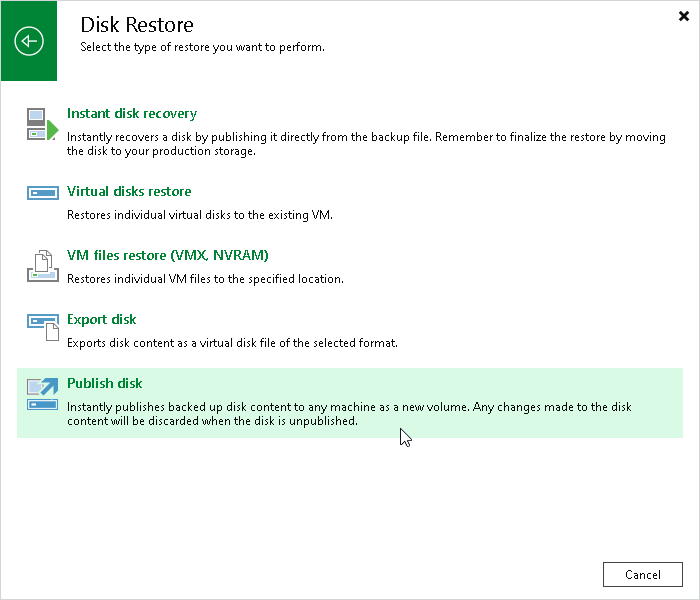

# Step 1. Launch Wizard

To launch the Publish Disks wizard, do one of the following:

* On the Home tab, click Restore and select one of the following:

* VMware vSphere > Restore from backup > Disk Restore > Publish disk — to publish a disk of a VMware vSphere VM from a backup created by Veeam Backup & Replication.

* VMware Cloud Director > Restore from backup > VM restore > Disk Restore > Publish disk — to publish a disk of a VMware Cloud Director VM from a backup created by Veeam Backup & Replication.
* Microsoft Hyper-V > Restore from backup > Entire VM restore > Publish disk — to publish a disk of a Hyper-V VM from a backup created by Veeam Backup & Replication.

* Agent > Disk Restore > Publish disk — to publish a disk of a physical machine or a virtual machine from a backup created by Veeam Agents.
* AWS > Amazon EC2 > Entire machine restore > Publish disk — to publish a disk of an EC2 instance from a backup created by Veeam Backup for AWS.
* Azure IaaS backup> Entire machine restore > Publish disk — to publish a disk of an Azure VM from a backup created by Veeam Backup for Microsoft Azure.
* GCE backup > Entire machine restore > Publish disk — to publish a disk of a VM instance from a backup created by Veeam Backup for Google Cloud.
* Nutanix backup > Entire machine restore > Publish disk — to publish a disk of a VM from a backup created by Veeam Plug-In for Nutanix AHV.
* oVirt KVM > Entire machine restore > Publish disk — to publish a disk of a VM from backups created by Veeam Plug-In for oVirt KVM.
* Kasten backup > Publish disk — to publish a disk of a VM whose backups were exported by [Kasten policies](https://helpcenter.veeam.com/docs/vbr/kasten_integration/overview.html?ver=13).

* Proxmox VE > Publish disk — to publish a disk of a Proxmox VE VM from a backup created by Veeam Plug-In for Proxmox VE.
* Scale Computing HyperCore > Publish disk — to publish a disk of a Scale Computing HyperCore VM from a backup created by Veeam Plug-in for Scale Computing HyperCore.
* Xen > Publish disk — to publish a disk of a Xen VM from a backup created by Veeam Plug-in for Xen.

* Open the Home view. In the inventory pane, click Backups. In the working area, expand the necessary backup, select a workload whose disks you want to publish and click Publish Disks on the ribbon. Alternatively, you can right-click the workload and select Publish disks.

Page updated 2026-07-02

