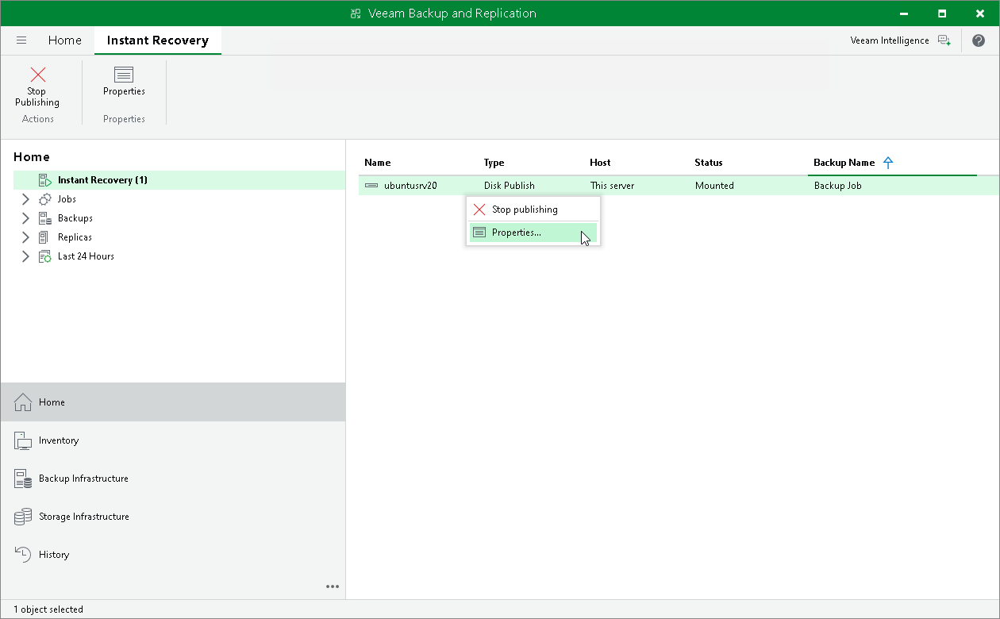
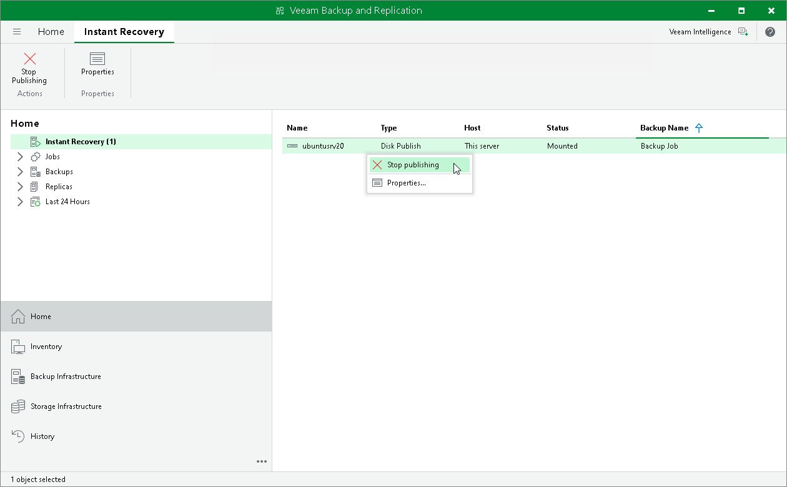

# Managing Published Disks

In this article

After you started a publishing session, you can check details on this session or stop it.

Viewing Statistics on Publishing Session

To view publishing session statistics, do one of the following:

* Open the Home view. In the inventory pane, select Instant Recovery. In the working area, select the necessary publishing session and click Properties on the ribbon. Alternatively, right-click the session and Properties.
* Open the Home view. In the inventory pane select Last 24 hours. In the working area, double-click the necessary publishing session. Alternatively, you can select the session and click Statistics on the ribbon or right-click the session and select Statistics.
* Open the [History](vbr_ui.md#views) view. In the inventory pane select Restore. In the working area, double-click the necessary mount session. Alternatively, you can select the session and click Statistics on the ribbon or right-click the session and select Statistics.

The publishing statistics provides the following data:

* At the top of the Restore Session window, Veeam Backup & Replication shows general session statistics. It includes a name of the workload whose disk you want to publish, a name of the backup server which initiated the publishing session, a user name of the account under which the session was started, session status, and duration details.

* The Reason tab shows the reason for the publishing session.
* The Parameters tab shows information about the target server, the machine whose disks you publish and the restore point selected for publishing.
* The Log tab shows the list of operations performed during the session.

Stopping Publishing Session

To stop a publishing session, do one of the following:

* Open the Home view. In the inventory pane select Instant Recovery. In the working area, select the necessary publishing session and click Stop Publishing on the ribbon. Alternatively, right-click the session and Stop Publishing.
* Open the Home view. In the inventory pane select Last 24 hours. In the working area, select the necessary publishing session and click Stop Publishing on the ribbon. Alternatively, right-click the session and Stop Publishing.
* Open the [History](vbr_ui.md#views) view. In the inventory pane select Restore. In the working area, select the necessary publishing session, double-click it. In the Restore Session window, click Cancel restore task.

Page updated 7/21/2025

Page content applies to build 13.0.1.1071
