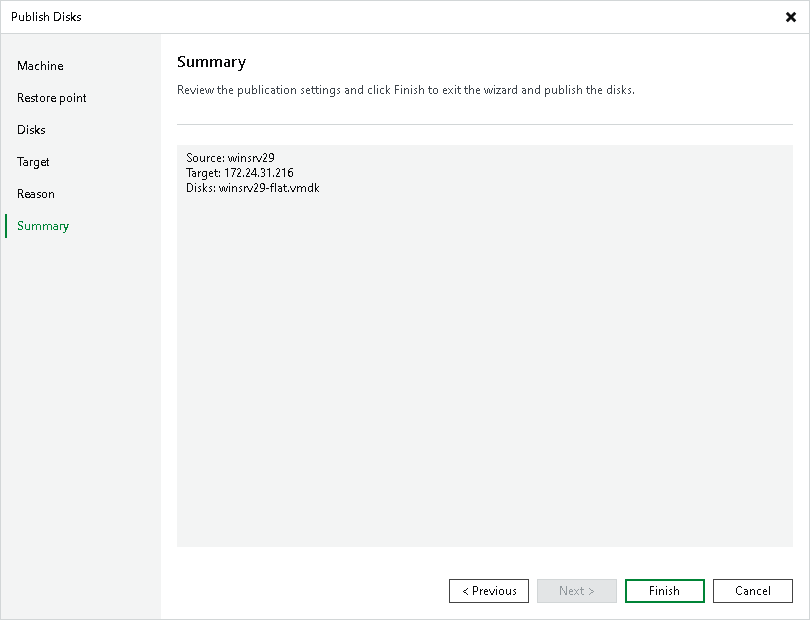

# Step 7. Finish Working with Wizard

In this article

At the Summary step of the wizard, review the configured settings and click Finish.

What You Do Next

Depending on the file system of the disk, go to the following locations on the target server to browse disk content:

* [Microsoft Windows file systems] Go to C:\VeeamFLR\ folder.

* [Linux, Unix and other file systems] Go to the /tmp/Veeam.Mount.Disks location to browse disk images. Go to the /tmp/Veeam.Mount.FS location to browse disk content.

Page updated 3/11/2025

Page content applies to build 13.0.1.1071
