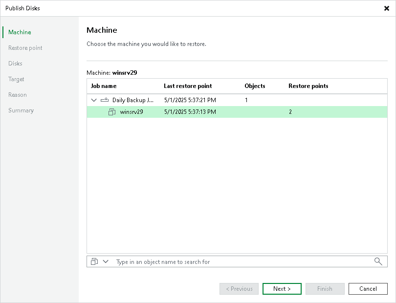

# Step 2. Select Workload

In this article

At the Machine step of the wizard, expand a backup and select a workload whose disks you want to publish.

Page updated 3/11/2025

Page content applies to build 13.0.1.1071
