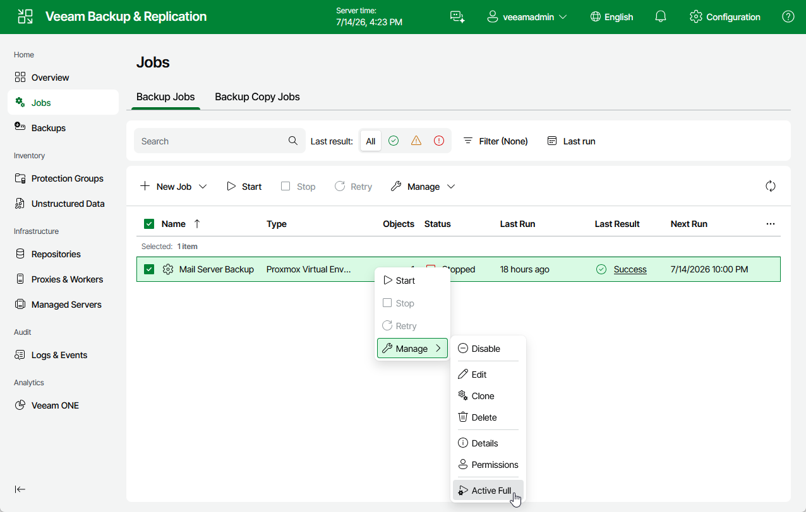

# Creating Active Full Backup

You can manually create an [active full backup](pve_active_full_backup.md) for all VMs added to a backup job.

1. Navigate to Jobs.
2. Select the necessary backup job and click Manage > Active Full.

|  |
| --- |
| Note |
| To create active full backup automatically according to a specific schedule, configure backup job settings as described in section [Creating Backup Jobs](pve_backup_job_create_schedule_web.md) (step 6). |

Page updated 2026-07-14

