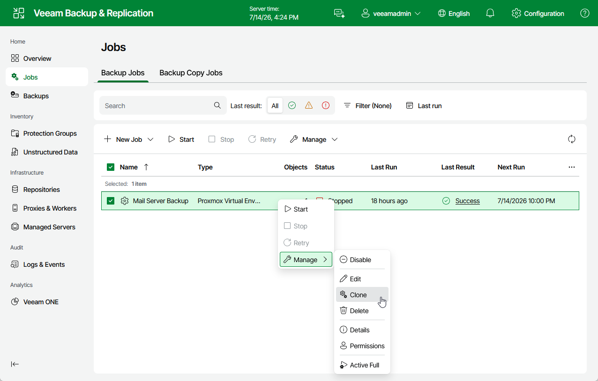

# Cloning Jobs

You can create a new job by cloning an existing one. Job cloning allows you to create an exact copy of any job with the same job settings. To clone a job, do the following:

1. Navigate to Jobs.
2. Right-click the necessary job and select Clone.

Alternatively, select the necessary job and click Manage > Clone.

The name of the cloned job is formed by the following rule: <job\_name\_clone1>, where job\_name is the name of the original job and clone1 is a suffix added to the original job name. If you clone the same job again, the number in the name will be incremented, for example, job\_name\_clone2, job\_name\_clone3 and so on. To change the name of a cloned job, edit the job as described in section [Editing Job Settings](pve_backup_job_edit_web.md).

|  |
| --- |
| Note |
| If the original job is scheduled to run automatically, Veeam Backup & Replication disables the cloned job. To enable the cloned job, select it in the job list and click Enable. |

Page updated 2026-07-27

