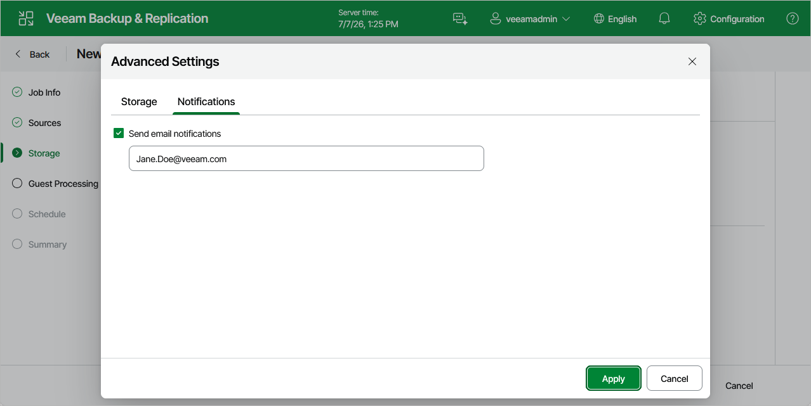

# Configuring Advanced Settings

In the Advanced Settings window, you can specify backup file storage settings and customize email notifications.

Storage Settings

To specify storage settings for backup files created by the backup job, switch to the Storage tab and do the following:

1. To decrease the size of the files, select a compression level from the Compression level drop-down list (None, Dedupe-friendly, Optimal, High or Extreme). For more information on data compression, see [Compression and Deduplication](compression_deduplication.md).
2. To optimize job performance and storage usage, select a block size from the Storage optimization drop-down list. Veeam Backup & Replication will use this size to "split" VM images into separate data blocks when processing VMs — the more data blocks there are, the more time is required to process the VM images. For more information on how data block sizes affect performance, see [Storage Optimization](compression_deduplication.md).

Notification Settings

To instruct Veeam Backup & Replication to send email notifications on the backup job results, switch to the Notifications tab, select the Send email notifications check box and specify an email address of a recipient; use a semicolon to separate multiple recipient addresses. For Veeam Backup & Replication to be able to send email notifications, you must configure a mail server as described in section [Configuring Email Notification Settings](pve_email_settings.md).

|  |
| --- |
| Note |
| Email notifications on the backup job results will be also sent to recipients configured in the [global notification settings](pve_email_settings.md). |

Page updated 2026-07-20

