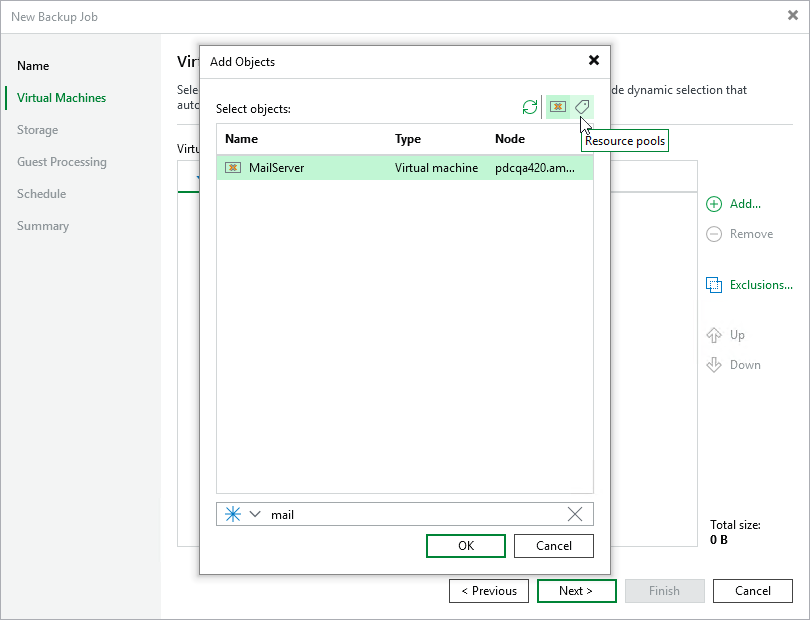
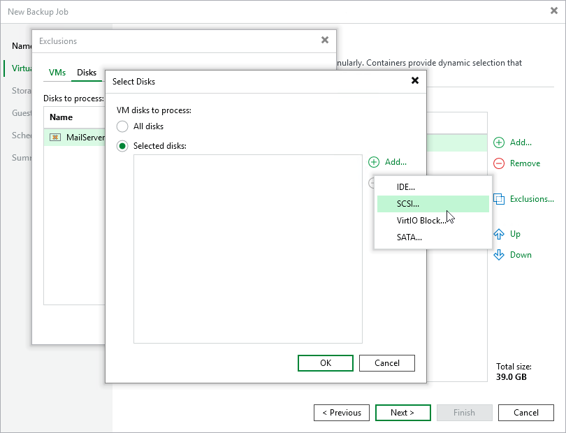

# Step 3. Configure Backup Source Settings

At the Virtual Machines step of the wizard, specify the backup scope — resources that Veeam Backup & Replication will back up.

Step 3a. Choose Virtual Machines

Specify VMs that will be included into the backup scope:

1. Click Add.
2. In the Add Objects window, choose whether you want to back up all VMs in the cluster or host, only specific VMs or groups of VMs included into resource pools:

To view the list of available resource pools, click the Resource pool icon on the toolbar at the top right corner of the window. If you add a resource pool to the backup scope, Veeam Backup & Replication will regularly check for new VMs included into the added pool and automatically update the backup job settings to include these VMs in the scope. For a resource pool to be displayed in the list, it must be configured in the Proxmox VE administration portal and must contain at least one VM. For more information on resource pools, see [Proxmox VE documentation](https://pve.proxmox.com/pve-docs/pve-admin-guide.html#pveum_resource_pools).

|  |
| --- |
| Tip |
| As an alternative to specifying resources explicitly, you can exclude a number of resources from the backup scope. To do that, click Exclusions and specify the VMs that you do not want to back up — the procedure is the same as described for including resources in the backup scope.  Consider that if a resource appears both in the list of included and excluded resources, Veeam Backup & Replication will still not process the resource because the list of excluded resources has a higher priority. |

While running the job, Veeam Backup & Replication processes resources in the order they are added to the backup scope. However, you can change the order, for example, if you add some mission-critical VMs to the job and want them to be processed first. To change the processing order, select a resource and use the Up or Down buttons.

|  |
| --- |
| Note |
| Consider the following:   * If you include the same resource into the backup scope multiple times (for example, an individual VM and a resource pool that contains this VM), Veeam Backup & Replication will process this resource only once.  * If you include a resource pool, node or cluster into the backup scope, VMs in this object are processed at random. To ensure that the VMs are processed in a specific order, you must add them as standalone VMs — not as part of the resource pool, host or cluster. |

Step 3b. Choose Disks and Volume Groups

By default, jobs process all disks and volume groups attached to VMs included into the backup scope. However, you can instruct Veeam Backup & Replication to back up only specific virtual disks and volume groups related to the selected backup scope:

1. Click Exclusions.
2. In the Exclusions window, switch to the Disks tab and click Add.
3. In the Add Objects window, select a resource that you have added to the backup scope and click OK.
4. Back to the Exclusions window, select the resource and click Edit.
5. In the Select Disks window, select the Selected Disks option, click Add and choose a bus type of the disks that you want to back up. Then, select the necessary disks.

Disks that you do not select will be excluded from the backup job.

