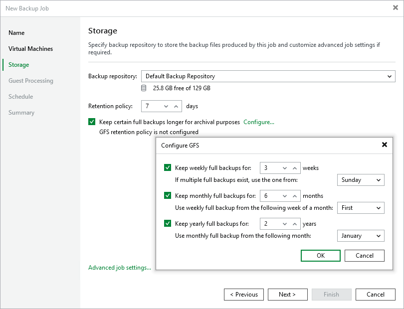

# Configuring GFS Policy Schedules

Grandfather-Father-Son (GFS) policy allows you to leverage full backups for long-term retentions instead of creating a new full backup every time. The mechanism simplifies the backup schedule and optimizes the backup performance.

Veeam Backup & Replication re-uses full backups created according to the backup job schedule to achieve the desired retention for a GFS policy schedule (weekly, monthly and yearly). Each full backup is marked with a flag of a specific GFS policy schedule type: the (W) flag is used to mark full backups for the weekly schedule, (M) — monthly, and (Y) — yearly. Veeam Backup & Replication uses these flags to control the retention period for the created full backups. Once a flag of a GFS policy schedule is assigned to a full backup, this full backup can no longer be removed — it is kept for the period defined in the retention settings. When the specified retention period is over, the flag is unassigned from the full backup. If the full backup does not have any other flags assigned, it is removed according to the short-term retention policy settings. For more information on the GFS flag assignment and removal, see [Long-Term Retention Policy (GFS)](gfs_retention_policy.md).

To configure a GFS policy schedule, select the Keep certain full backups longer for archival purposes check box and click Configure. Then, specify the following options in the Configure GFS window:

* Keep weekly full backups — Veeam Backup & Replication will keep a full backup created within a week or on the specific day for a number of weeks.
* Keep monthly full backups — Veeam Backup & Replication will keep a full backup created during the specific week for a number of months.
* Keep yearly full backups — Veeam Backup & Replication will keep a full backup created in the specific month for a number of years.

After you configure the GFS retention policy settings, [schedule active full or synthetic full backups](pve_backup_job_create_advanced.md). Otherwise, no new full backups will be automatically produced, and Veeam Backup & Replication will be unable to leverage them for long-term retentions.

|  |
| --- |
| Note |
| If you choose an object storage repository to store backups produced by the backup job, you cannot enable synthetic full backups. However, if you configure a GFS policy, synthetic backups will be automatically created according to the specified GFS schedule and marked with an appropriate GFS flag. |

