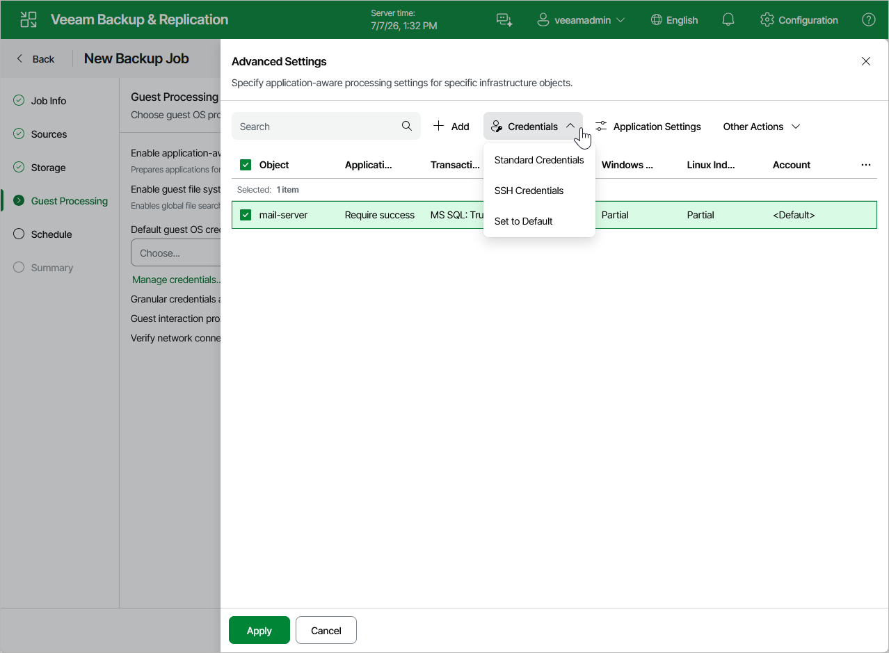

# Step 5d. Manage VM Guest OS Credentials

If you enable application-aware processing or instruct Veeam Backup & Replication to create a catalog of VM files and folders, you must also specify a user whose credentials will be used to communicate with VM guest OSes. Note the specified user must have the permissions required to perform guest processing. For more information on the required permissions, see [Planning and Preparation](pve_permissions.md).

By default, Veeam Backup & Replication uses single credentials to access guest OSes of all VMs included into the backup scope. However, since Windows-based VMs and Linux-based VMs require different types of access credentials, you may need to specify the credentials explicitly for each of the processed VMs. To do that, click Configure in the Granular credentials and advanced settings field, select a VM, and then click Credentials > Standard credentials (for a Windows-based VM) or Credentials > SSH credentials (for a Linux-based VM).

For a user to be displayed in the Credentials list, it must be added to the Credentials Manager as described in section [Credentials Manager](credentials_manager.md). If you have not added the necessary user to the Credentials Manager beforehand, you can do it without closing the New Backup Job wizard. To do that, click either the Manage credentials link or the Add button, and specify the user name, password and description in the Manage Credentials window.

|  |
| --- |
| Tip |
| If the backup scope includes a resource pool, host or cluster, you can specify both Standard and SSH credentials. This will allow Veeam Backup & Replication to access the processed VMs regardless of their guest OSes. |

To check whether Veeam Backup & Replication is able to connect to the VM guest OSes using the specified credentials, click Test in the Verify network connectivity and credentials field.

Page updated 2026-07-20

