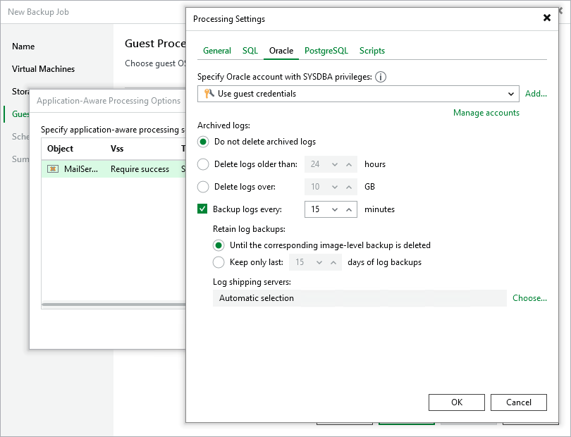

# Specifying Oracle Archived Redo Log Settings

By default, Veeam Backup & Replication creates application-consistent image-level backups of VMs running the Oracle application and does not truncate archived redo logs after each successfully completed backup session — this allows you to restore Oracle databases using specific backups. To protect mission-critical Oracle databases, you can instruct Veeam Backup & Replication to create secondary restore points with archived redo logs in addition to primary image-level backups — this will allow you to restore your databases to [specific points in time](https://helpcenter.veeam.com/docs/vbr/explorers/vesql_restoring_pit.html?ver=13).

|  |
| --- |
| Notes |
| * Veeam Backup & Replication stores image-level backups and archived redo log backups in the same repository. * If Veeam Backup & Replication fails to produce a primary image-level backup, no secondary archived redo log backups will be created. |

To back up Oracle archived redo logs periodically, do the following:

1. Switch to the Oracle tab.
2. In the Backup logs every field, specify how frequently you want archived redo logs to be backed up. The maximum field value is 480 minutes.
3. In the Retain log backups section, choose either of the following options:

* Select the Until the corresponding image-level backup is deleted option if you want to remove archived redo log backups and the related image-level backups at the same time, according to the retention policy settings specified at [step 4](pve_backup_job_create_destination.md).

* Select the Keep only last <N> days of log backups if you want to retain archived redo log backups for a specific time period, regardless of the retention policy settings specified for image-level backups. Note that archived redo logs backups must always be retained for a longer period than image-level backups.

For more information on how Veeam Backup & Replication retains archived redo logs, see [Retention for Archived Log Backup](oracle_backup_retention.md).

1. In the Log shipping servers section, decide whether you want to use a specific server to transfer archived redo logs backups or let Veeam Backup & Replication choose it automatically to reduce the load on the backup server.

By default, Veeam Backup & Replication automatically chooses a log shipping server for each of the processed VMs based on network settings and rules listed in section [Log Shipping Servers](sql_backup_log_shipping.md). You can also manually limit the list of machines that may be used as log shipping servers — to do that, click Choose, select the Use the specified servers only option and then select check boxes next to the necessary servers.

For a server to be displayed in the list of available log shipping servers, it must be added to the backup infrastructure as described sections [Adding Microsoft Windows Servers](add_windows_server.md) and [Adding Linux Servers](add_linux_server.md).Keep in mind that the list will also include Linux servers added to the backup infrastructure; however, Linux servers cannot be used as log shipping servers for processing Windows-based VMs due to technical limitations in the current version.

|  |
| --- |
| TipS |
| * It is recommended that you choose at least 2 log shipping servers for load balancing and high availability purposes. * It is recommended that you do not choose servers that are engaged in permanent tasks consuming resources (such as WAN accelerators or backup servers). |

You can choose to keep the default Do not delete archived logs option, but in this case archived redo logs may grow large and increase the storage space consumption significantly. That is why it is recommended that you choose to remove archived redo logs that are older than a specific time limit or whose size exceeds a specific storage threshold. Keep in mind that the selected option will apply to logs of each processed Oracle database individually — and only after the backup job completes successfully.

Configuring Access to Oracle Data

To access databases of the processed Oracle applications, Veeam Backup & Replication uses accounts with [SYSDBA privileges](pve_permissions.md#veo) — by default, these are the accounts you specify for accessing the VM guest OSes. To change this behavior, you can choose another account from the Specify Oracle account with SYSDBA privileges drop-down list.

For an account to be displayed in the list of available accounts, it must be added to the Credentials Manager as described in section [Credentials Manager](credentials_manager.md). If you have not added the necessary account to the Credentials Manager beforehand, you can do it without closing the New Job wizard. To do that, click either the Manage accounts link or the Add button, and specify the user name, password and description in the Credentials window.

Considerations and Limitations

When you configure transaction log settings, consider the following:

* For Oracle databases running in the NOARCHIVELOG mode, Veeam Backup & Replication is not able to create restore points with archived redo logs — only image-level backups will be created. For more information on how to choose between database modes, see [Oracle documentation](https://docs.oracle.com/cd/B28359_01/server.111/b28310/archredo002.htm#ADMIN11330).
* For Veeam Backup & Replication to be able to access Oracle command-line tools when performing application-aware processing for Windows-based VMs, the %ORACLE\_HOME%\bin directory must be added to the PATH system variable. For more information on how to set Oracle environment variables, see [Oracle documentation](https://docs.oracle.com/en/database/oracle/oracle-database/26/rilin/setting-the-oracle-user-environment-variables.html).

