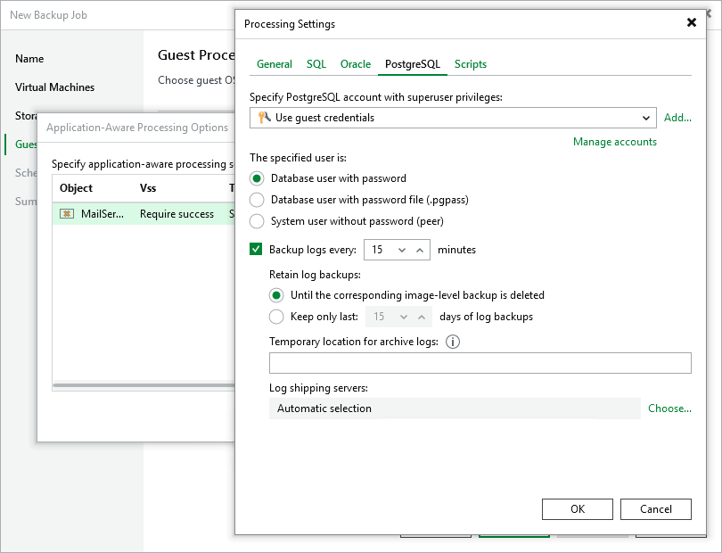

# Specifying PostgreSQL WAL Files Settings

By default, Veeam Backup & Replication creates application-consistent image-level backups of VMs running the PostgreSQL Server application and does not truncate write ahead logs (WAL) after each successfully completed backup session — this allows you to restore PostgreSQL Server databases using specific backups. To protect mission-critical PostgreSQL Server databases, you can instruct Veeam Backup & Replication to create secondary restore points with WAL logs in addition to primary image-level backups — this will allow you to restore your databases to [specific points in time](https://helpcenter.veeam.com/docs/vbr/explorers/vesql_restoring_pit.html?ver=13).

|  |
| --- |
| NoteS |
| * Veeam Backup & Replication stores image-level backups and WAL log backups in the same repository. * If Veeam Backup & Replication fails to produce a primary image-level backup, no secondary WAL log backups will be created. |

To back up PostgreSQL WAL logs periodically, do the following:

1. Switch to the PostgreSQL tab.
2. In the Backup logs every field, specify how frequently you want WAL logs to be backed up. The maximum field value is 480 minutes.
3. In the Retain log backups section, choose either of the following options:

* Select the Until the corresponding image-level backup is deleted option if you want to remove WAL log backups and the related image-level backups at the same time, according to the retention policy settings specified at [step 4](pve_backup_job_create_destination.md) of the wizard.

* Select the Keep only last <N> days of log backups if you want to retain WAL log backups for a specific time period, regardless of the retention policy settings specified for image-level backups. Note that WAL log backups must always be retained for a longer period than image-level backups.

For more information on how Veeam Backup & Replication retains WAL logs, see [Retention for PostgreSQL WAL Files](postrgresql_backup_retention.md).

1. In the Temporary location for archive logs section, specify the path to a folder on the PostgreSQL machine where Veeam Backup & Replication will temporarily store archive logs until they are backed up.

Keep in mind that you must create the folder beforehand manually. Also, make sure that there is enough free space in this folder for the log files and [required permissions](pve_permissions.md#postgresql) are granted to the user account.

1. In the Log shipping servers section, decide whether you want to use a specific server to transfer WAL log backups or let Veeam Backup & Replication choose it automatically to reduce the load on the backup server.

By default, Veeam Backup & Replication automatically chooses a log shipping server for each of the processed VMs based on network settings and rules listed in section [Log Shipping Servers](sql_backup_log_shipping.md). You can also manually limit the list of machines that may be used as log shipping servers — to do that, click Choose, select the Use the specified servers only option and then select check boxes next to the necessary servers.

For a server to be displayed in the list of available log shipping servers, it must be added to the backup infrastructure as described in sections [Adding Microsoft Windows Servers](add_windows_server.md) and [Adding Linux Servers](add_linux_server.md).

|  |
| --- |
| TiPS |
| * It is recommended that you choose at least 2 log shipping servers for load balancing and high availability purposes. * It is recommended that you do not choose servers that are engaged in permanent tasks consuming resources (such as WAN accelerators and backup servers). |

Configuring Access to PostgreSQL Data

To access databases of the processed PostgreSQL Server instances, Veeam Backup & Replication uses accounts with [superuser privileges](pve_permissions.md#postgresql) — by default, these are the accounts you specify for accessing the VM guest OSes. To change this behavior, you can choose another account from the Specify PostgreSQL account with superuser privileges drop-down list. For an account to be displayed in the list of available accounts, it must be added to the Credentials Manager as described in section [Credentials Manager](credentials_manager.md). If you have not added the necessary account to the Credentials Manager beforehand, you can do it without closing the New Job wizard. To do that, click either the Manage accounts link or the Add button, and specify the user name, password and description in the Credentials window.

After you choose an account, you must also explicitly specify whether this account is a PostgreSQL database account (whose password is stored either in the Credentials Manager or in a configuration file) or a [system account](https://www.postgresql.org/docs/current/auth-peer.html). In the latter case, make sure that the account has all the permissions required to access the PostgreSQL Server instance; for more information on the required permissions, see [Planning and Preparation](pve_permissions.md#postgresql).

|  |
| --- |
| Important |
| Consider the following:   * If the password that is stored in the Credential manager is empty, Veeam Backup & Replication will be able to use this account by leveraging username map authentication. In this case, the SYSTEM-USERNAME variable value will be set to the name of the account used to access the VM guest OS, while the PG-USERNAME variable value will be set to the name of the account that you have selected from the Specify PostgreSQL account with superuser privileges drop-down list. For more information on username map authentication, see [PostgreSQL documentation](https://www.postgresql.org/docs/current/auth-username-maps.html). * If the password is stored in a .PGPASS configuration file, make sure that it is located in the /home directory of the selected account. For more information on .PGPASS files, see [PostgreSQL documentation](https://www.postgresql.org/docs/current/libpq-pgpass.html). |

Depending on the scope of resources that you have specified at [step 5a](pve_backup_job_create_gp_applications.md) of the wizard, Veeam Backup & Replication will use the selected account in the following way:

* If the scope includes an individual VM, the account will be used to access the PostgreSQL Server instance running on this specific VM.
* If the scope includes multiple individual VMs, the account will be used to access the PostgreSQL Server instance running on each of these VMs.
* If the scope includes a VM container (such as resource pool, host or cluster), the account will be used to access every PostgreSQL Server instance running on VMs in this container.

