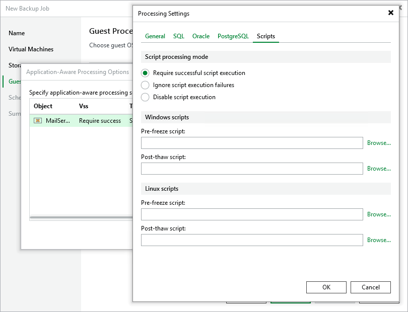

# Specifying Pre-Freeze and Post-Thaw Scripts

If you plan to back up VMs running applications that do not support VSS, you can specify what scripts Veeam Backup & Replication must use to quiesce the VM. The pre-freeze script quiesces the VM file system and application data to bring the VM to a consistent state before Veeam Backup & Replication triggers a VM snapshot. After the VM snapshot is created, the post-thaw script brings the VM and applications to their initial state.

To specify pre-freeze and post-thaw scripts for the job:

1. Switch to the Scripts tab.
2. In the Script processing mode section, choose a scenario for script execution:

* Select the Require successful script execution option if you want Veeam Backup & Replication to stop the backup process if the script fails.
* Select the Ignore script execution failures option if you want to continue the backup process, even if script errors occur.
* Select the Disable script execution option if you do not want to run scripts for the VM.

1. In the Windows scripts section, specify paths to pre-freeze and post-thaw scripts for Microsoft Windows VMs. For the list of supported script formats, see [Pre-Freeze and Post-Thaw Scripts](pre_post_scripts.md).
2. In the Linux scripts section, specify paths to pre-freeze and post-thaw scripts for Linux VMs. For the list of supported script formats, see [Pre-Freeze and Post-Thaw Scripts](pre_post_scripts.md).

|  |
| --- |
| Tip |
| If you have added a resource pool, host or cluster with Microsoft Windows and Linux VMs to the job, you can select to execute both Microsoft Windows and Linux scripts for the VM container. When the job starts, Veeam Backup & Replication will automatically determine what OS type is installed on the VM and use the required scripts to quiesce this VM. |

