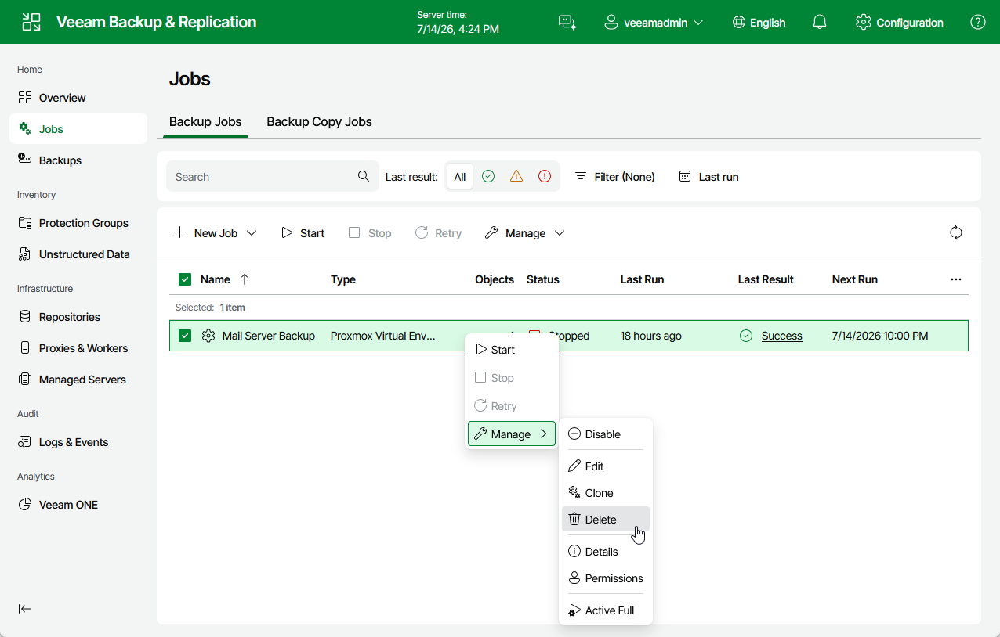

# Deleting Jobs

You can permanently delete a job from the Veeam Backup & Replication configuration database if you no longer need it. When you delete a job, backups created by this job are displayed under the Backups > Disk (Orphaned) node in the Home view of the Veeam Backup & Replication console. If you want to delete backup files as well, follow the instructions provided in section [Deleting Backups](pve_backups_delete.md).

To delete a job, do the following:

1. Navigate to Jobs.
2. Select the necessary job.
3. Click Manage > Delete.

Page updated 2026-07-27

