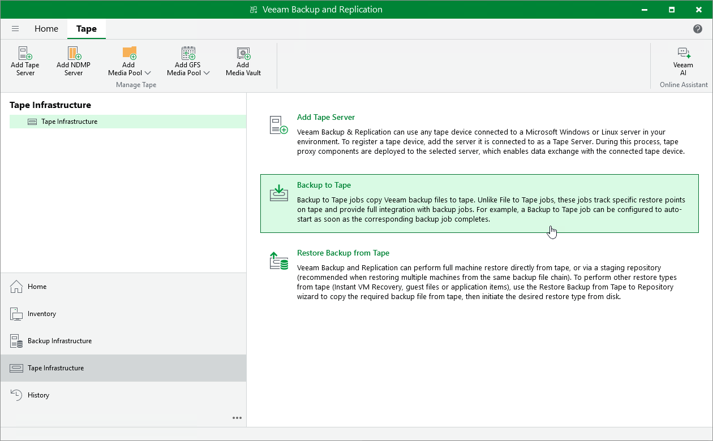

# Copying Backups to Tapes

You can create archives of VM backups and copy them to tapes for long-term storage. Veeam Backup & Replication allows you to manage tape archives the same way you manage backups in backup repositories. However, it usually takes more time to access archived data on tapes than to access backed-up data in repositories. For more information on tapes, see [Tape Devices Support](tape_device_support.md).

To archive VM backups to tape, do the following:

1. Configure the tape infrastructure:

1. Connect tape devices as described in section [Tape Devices Deployment](tape_deployment.md).
2. Perform initial configuration of the tape infrastructure as described in section [Getting Started with Tapes](getting_started_with_tapes.md) (steps 1–3).

1. Create a backup to tape job as described in section [Creating Backup to Tape Jobs](creating_backup_to_tape_jobs.md).

|  |
| --- |
| Note |
| You cannot restore Proxmox VE VMs directly from tapes. To restore a Proxmox VE VM, you must first restore its backups to a repository as described in section [Backup Restore from Tape to Repository](vm_restore_from_tape_to_repository.md). |

