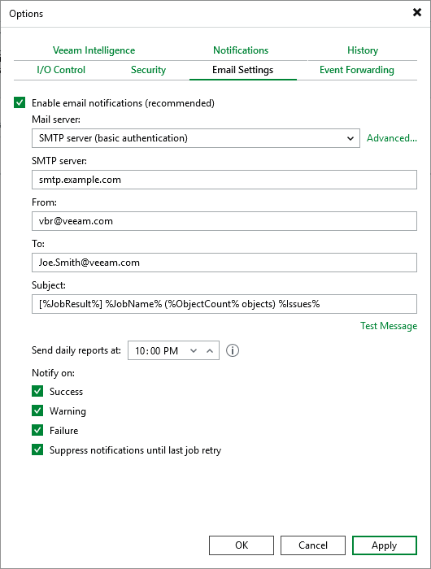
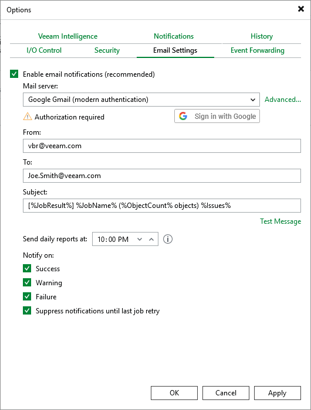
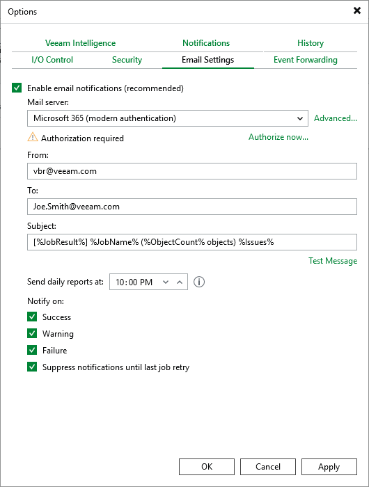

# Configuring Email Settings

You can specify email notification settings for automated delivery of job results. To connect a mail server that will be used for sending email notifications:

1. From the main menu of the Veeam Backup & Replication console, select Options.
2. Switch to the E-mail Settings tab.
3. Select the Enable e-mail notifications check box.
4. Configure [mail server settings](#server).
5. In the From field, enter an email address of the notification sender. This email address will be displayed in the From field of notifications.
6. In the To field, enter an email address of a recipient. Use a semicolon to separate multiple recipient addresses.
7. In the Subject field, specify a subject for notifications. You can use the following runtime variables:

* %JobName% — a job name.
* %JobResult% — a job result.
* %ObjectCount% — the number of VMs in a job.

1. Choose whether you want to receive email notifications in case jobs complete successfully, complete with warnings or complete with errors.

1. Select the Suppress notifications until the last job retry check box to receive a notification about the final job status. If you do not select this check box, the Veeam Backup & Replication will send one notification for every job retry.

1. Click Apply.

|  |
| --- |
| Tip |
| Veeam Backup & Replication allows you to send a test message to check whether you have configured the settings correctly. To do that, click Test Message. A test message will be sent to the specified email address. |

Configuring Mail Server Settings

To configure mail server settings, choose whether you want to employ [SMTP server](#basic), [Google Gmail](#modern_google) or [Microsoft 365](#modern_ms) authentication for your mail server.

Using SMTP Server Basic Authentication

To employ the SMTP server basic authentication to connect to your mail server, do the following in the Options window:

1. From the Mail server drop-down list, select SMTP server (basic authentication).
2. In the SMTP server field, enter a DNS name or an IP address of the SMTP server. All email notifications (including test messages) will be sent by this SMTP server.
3. Click Advanced next to the Mail server field and configure SMTP server settings:

1. In the Port field, specify a communication port for SMTP traffic. The default SMTP port is 587 (SSL enabled) or 25 (SSL disabled).
2. In the Timeout field, specify a connection timeout for responses from the SMTP server.
3. For an SMTP server with SSL/TLS support, select the Connect using SSL check box to enable SSL data encryption.
4. If your SMTP server requires authentication, select the This SMTP server requires authentication check box and specify credentials that will be used to connect to the SMTP server.

Using Google Gmail Modern Authentication

To employ the Google Gmail modern authentication to connect to your mail server, do the following in the Options window:

1. From the Mail server drop-down list, select Google Gmail (modern authentication).
2. Click Sign in with Google. You will be redirected to the authorization page.
3. On the authorization page, specify a Google account to connect to the Veeam Backup & Replication application. Note that you must also select the Send email on your behalf check box.

|  |
| --- |
| Tip |
| If you want to use your own web application for email notifications, do the following:   1. Register a new client application in the [Google Cloud console](registering_google_app.md) for Veeam Backup & Replication to be able to use OAuth 2.0 to access Google Cloud APIs. When registering the application, it is recommended to use a dedicated service account with granular SendMail permissions. 2. In the Options window, click Advanced. 3. In the Advanced window, select the Use custom registration settings check box, and provide the application client ID and client secret created for the application as described in [Google Cloud documentation](https://developers.google.com/workspace/guides/create-credentials#oauth-client-id). 4. Click Sign in with Google. You will be redirected to the authorization page. 5. On the authorization page, specify a Google account to connect to the registered application. Note that you must also select the Send email on your behalf check box. |

If the authentication process completes successful, Veeam Backup & Replication will display a message notifying that the token is valid. If the token gets revoked or if the Google account password changes, click Re-authorize to update the configuration settings.

Using Microsoft 365 Modern Authentication

To employ the Microsoft 365 modern authentication to connect to your mail server, do the following in the Options window:

1. From the Mail server drop-down list, select Microsoft 365 (modern authentication).
2. Click Authorize now. You will be redirected to the authorization page.
3. On the authorization page, specify an Exchange Online account to connect to the Veeam Backup & Replication application. Note that you must also select the Consent on behalf of your organization check box.

To sign in with Exchange Online credentials, you may need to turn off the Internet Explorer Enhanced Security Configuration option in Server Manager as described in [Microsoft documentation](https://learn.microsoft.com/en-us/previous-versions/troubleshoot/browsers/security-privacy/enhanced-security-configuration-faq#how-to-turn-off-internet-explorer-esc-on-windows-servers).

|  |
| --- |
| Tip |
| If you want to use your own web application for email notifications, do the following:   1. Register a new client application in the [Microsoft Azure portal](registering_azure_app.md) for Veeam Backup & Replication to be able to use OAuth 2.0 to access Microsoft Azure APIs. When registering the application, it is recommended to use a dedicated service account with granular SendMail permissions. 2. In the Options window, click Advanced. 3. In the Advanced window, select the Use custom registration settings check box, and provide the application client ID and tenant ID created for the application as described in [Microsoft documentation](https://learn.microsoft.com/en-us/azure/active-directory/develop/quickstart-register-app#add-a-client-secret). 4. Click Authorize now. You will be redirected to the authorization page. 5. On the authorization page, specify a Exchange Online account to connect to the registered application. Note that you must also select the Send email on your behalf check box. |

If the authentication process completes successful, Veeam Backup & Replication will display a message notifying that the token is valid. If the token gets revoked or if the Microsoft account password changes, click Re-authorize to update the configuration settings.

