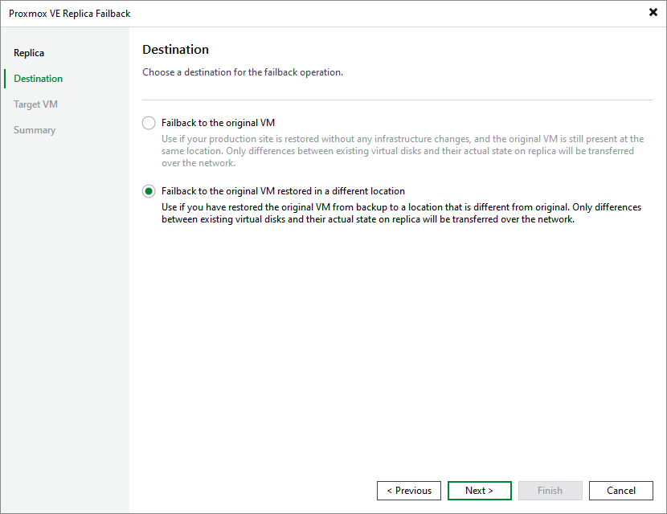

# Step 3. Specify Failback Destination

At the Destination step of the wizard, choose whether you want to fail back the selected replica to the original VM that resides on the source host or switch to the original VM that has been restored to a custom location. For more information on how Veeam Backup & Replication performs failback, see [Failback](pve_how_failback.md).

Page updated 2026-07-31

