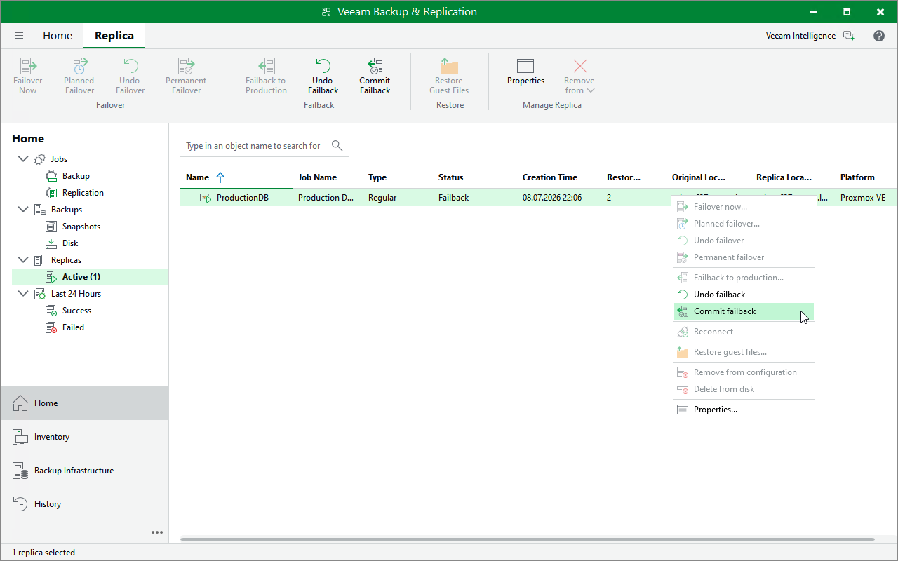

# Step 6. Finalize Failback

After the failback operation has completed, you can choose whether you want to commit or undo the failback. If you commit the failback, you confirm that the VM to which you failed back (the production VM) works as expected. If you undo the failback, Veeam Backup & Replication will power on the VM replica running on the target host and switch from the production VM back to the VM replica.

To finalize the failback operation, do the following:

1. In the Veeam Backup & Replication console, open the Home view.
2. In the inventory pane, navigate to the Replicas > Active node.
3. In the working area, right-click the VM:

* To confirm that the production VM works as expected, select Commit failback.
* To revert the VM replica to its pre-failback state, select Undo failback.

Page updated 2026-07-15

