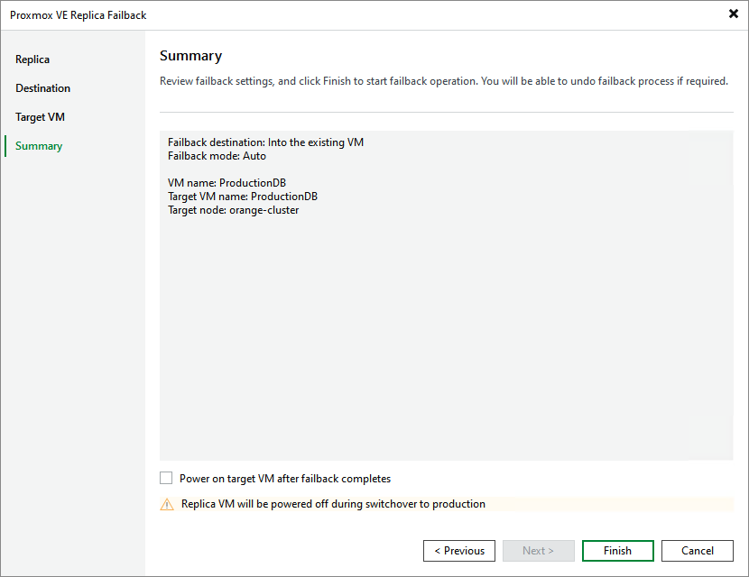

# Step 5. Finish Working with Wizard

At the Summary step of the wizard, review summary information and click Finish.

|  |
| --- |
| Tip |
| If you want to start the target VM as soon as the failback process completes, select the Power on target VM after failback completes check box. |

Page updated 2026-07-15

