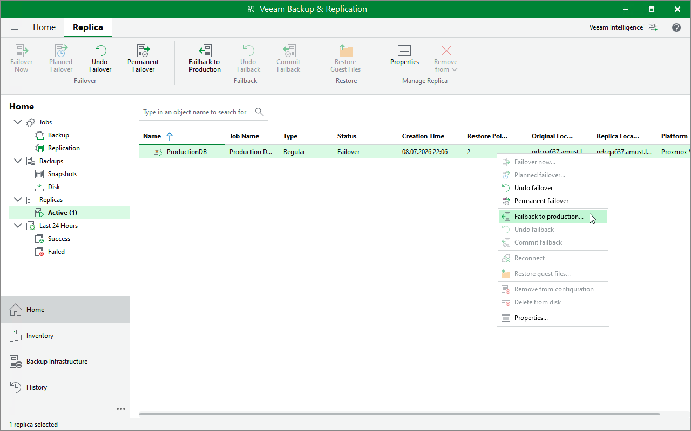

# Step 1. Launch Failback Wizard

To launch the Enter value Reolica Failback wizard, do the following:

1. In the Veeam Backup & Replication console, open the Home view.
2. In the inventory pane, select Replicas > Active.
3. In the working area, right-click the VM replica from which you want to fail back to the original VM and select Failback to Production.

Alternatively, select the replica and click Failback to Production on the ribbon.

Page updated 2026-07-15

