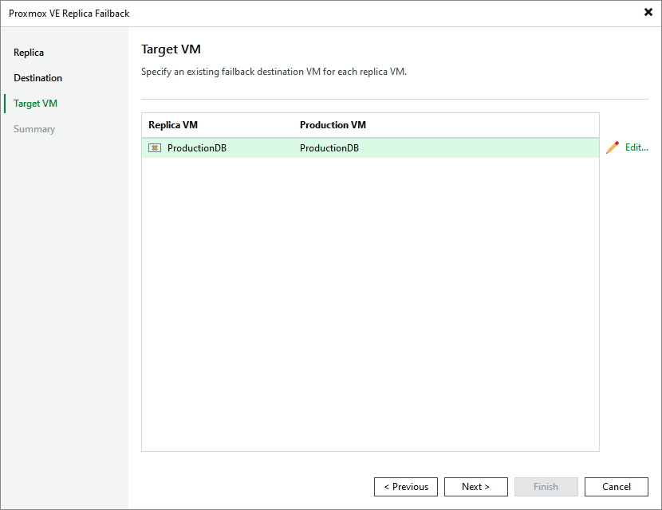

# Step 4. Specify Target VM

[This step applies only if you have selected the Failback to the original VM restored in a different location option at the Destination step of the wizard]

At the Target VM step of the wizard, specify to which VM you want to fail back from it replica. This VM must be already restored from backups in the required location.

Page updated 2026-07-16

