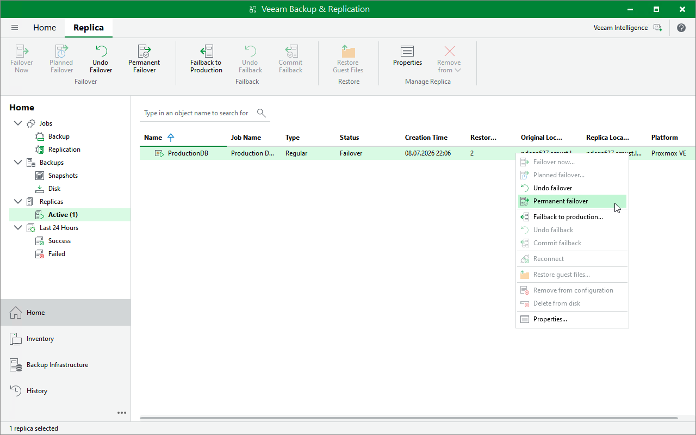

# Running Permanent Failover

To perform [permanent failover](pve_how_permanent_failover.md) to a replica in the Failover state, do the following:

1. Open the Home view.
2. In the inventory pane of the Home view, select Replicas > Active.
3. In the working area, right-click the replica to which you want to switch permanently from the original VM and select Permanent failover.

Alternatively, select the replica and click Permanent Failover on the ribbon.

Page updated 2026-07-31

