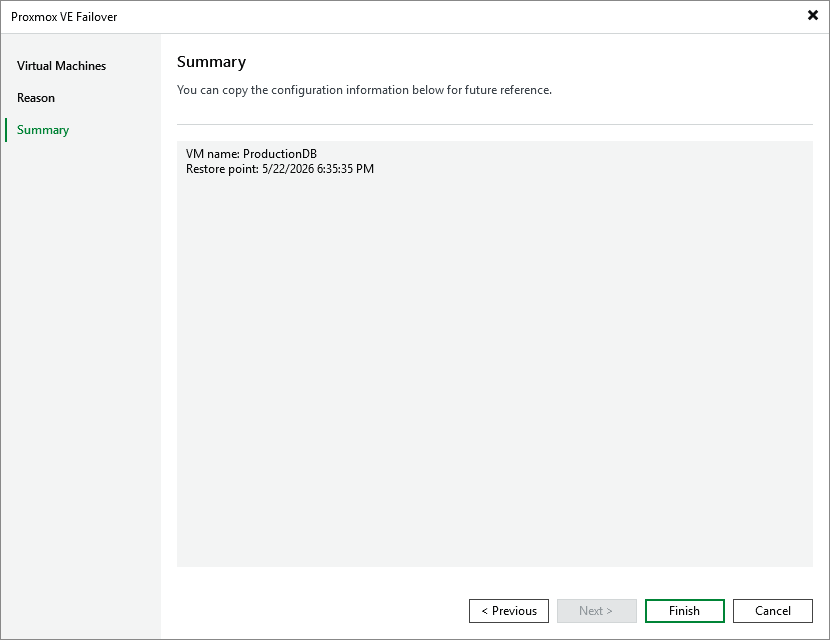

# Step 4. Finish Working with Wizard

At the Summary step of the wizard, review summary information and click Finish.

|  |
| --- |
| Tip |
| Failover is an intermediate step that you will have to finalize — by either running permanent failover or performing failback. For more information, see [Finalizing Failover](pve_failover_finalize.md) |

Related Topics

[Undoing Failover](pve_failover_undo.md)

Page updated 2026-07-21

