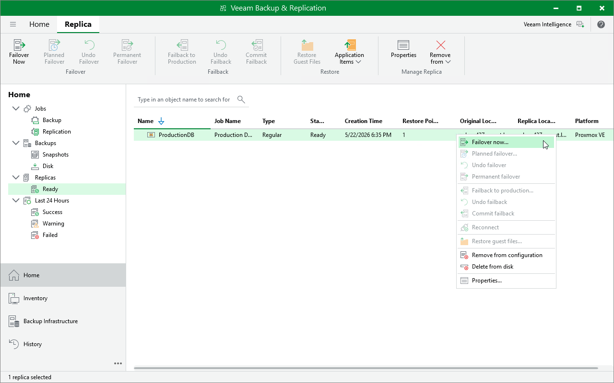

# Step 1. Launch Failover Wizard

To launch the Proxmox VE Failover wizard, do the following:

1. In the Veeam Backup & Replication console, open the Home view.
2. In the inventory pane, select Replicas > Ready.
3. In the working area, right-click the necessary VM and select Failover now.

Alternatively, select the necessary VM and click Failover Now on the ribbon.

Page updated 2026-07-21

