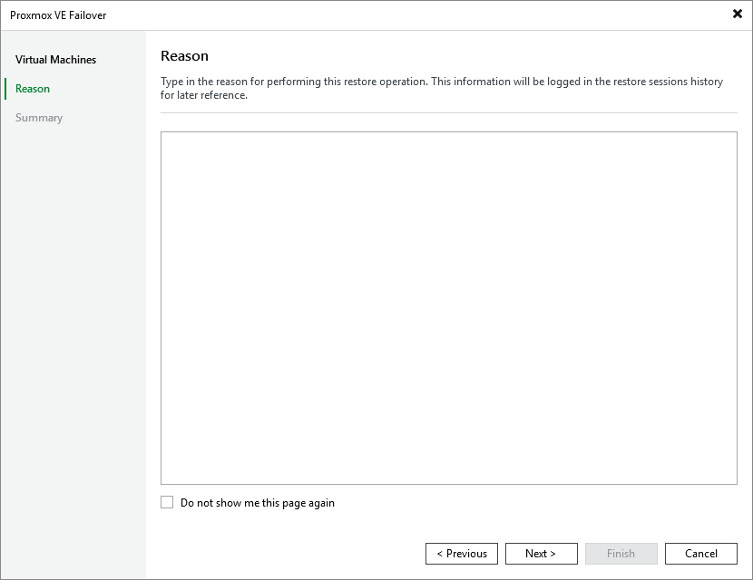

# Step 3. Specify Restore Reason

At the Reason step of the wizard, specify a reason for the failover. This information will be saved to the session history, and you will be able to reference it later.

Page updated 2026-07-21

