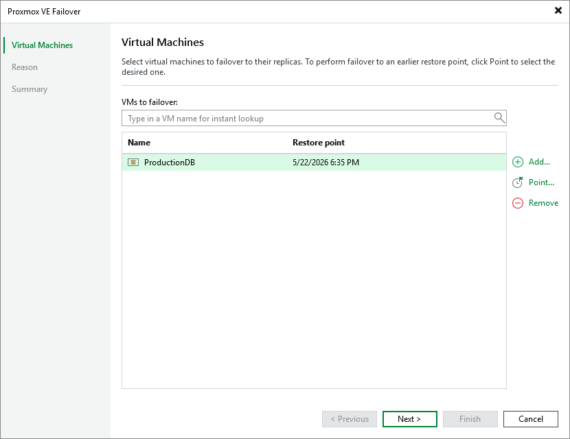

# Step 2. Select VMs

At the Virtual Machines step of the wizard, select a restore point that will be used to fail over the selected VM to its replica. By default, Veeam Backup & Replication uses the most recent valid restore point. However, you can fail over the VM to an earlier state.

To select a restore point, do the following:

1. Select the VM and click Point.
2. In the Restore Points window, select the necessary restore point and click OK.

To help you choose a restore point, Veeam Backup & Replication provides the following information on each available restore point:

* Job — the name of the replication job that created the restore point, and the date when the restore point was created.
* Type — the type of the restore point.
* Location — the repository where the restore point metadata is stored.

|  |
| --- |
| Tip |
| You can use the wizard to fail over multiple VMs at a time. To do that, click Add, select more VMs to fail over and choose a restore point for each of them. |

Page updated 2026-07-21

