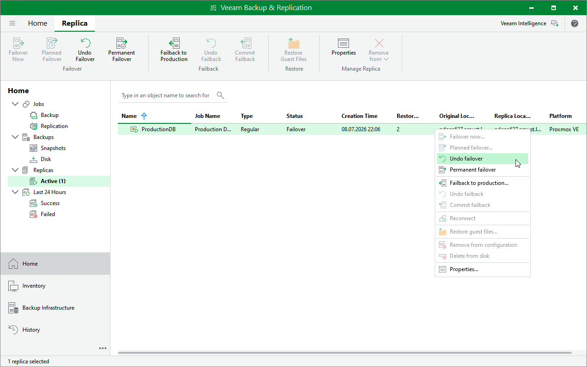

# Undoing Failover

The Undo failover action powers off VM replicas running on target hosts and rolls back to the VM state before failover. For more information on the undo failover operation, see [Failover Undo](pve_how_failover_undo.md).

To perform an undo failover operation for a replica in the Failover state:

1. Open the Home view.
2. In the inventory pane, navigate to the Replicas > Active node.
3. In the working area, right-click the replica that you want to roll back to the VM state before failover and select Undo failover.

Alternatively, select the replica and click Undo Failover on the ribbon.

|  |
| --- |
| Tip |
| You can instruct Veeam Backup & Replication to ignore failures during the undo failover operation. To do that, select the Force undo failover check box in the confirmation window — even if errors occur, Veeam Backup & Replication will switch back to the original VM and will change the VM replica state to Ready in the configuration database and console. |

Page updated 2026-07-20

