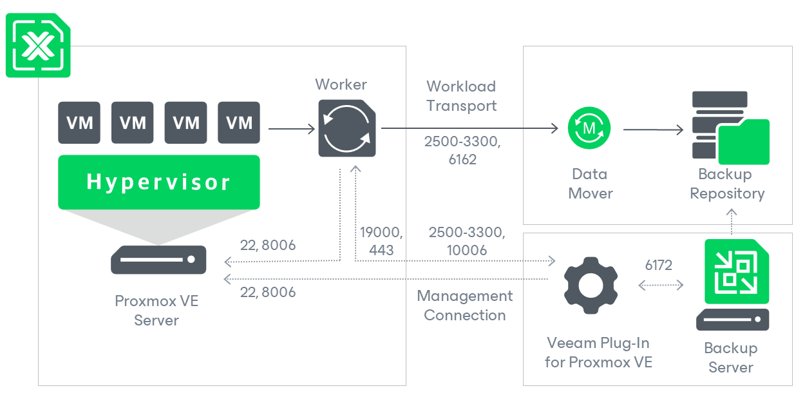

# Solution Architecture

Since Veeam Plug-in for Proxmox VE is integrated with Veeam Backup & Replication, the solution architecture comprises the following set of components:

* [Proxmox VE server](#cluster)
* [Backup server](#server)
* [Veeam Plug-in for Proxmox VE](#plugin)
* [Backup repositories](#repositories)
* [Workers](#workers)

Proxmox VE Server

A Proxmox VE server is standalone host or cluster node that runs the Proxmox VE software. Veeam Plug-in for Proxmox VE uses the server to access such Proxmox VE resources as storage, networks and VMs while performing backup and restore operations.

Backup Server

A backup server is either a Windows-based or Linux-based physical or virtual machine on which Veeam Backup & Replication is installed. The backup server is the configuration, administration and management core of the backup infrastructure. It coordinates backup and restore operations, controls job scheduling and manages resource allocation.

Veeam Plug-In for Proxmox VE

Veeam Plug-in for Proxmox VE is an architecture component that enables integration between the backup server and other components of the backup infrastructure. Veeam Plug-in for Proxmox VE allows Veeam Backup & Replication to connect to the Proxmox VE server, and to perform data protection and disaster recovery tasks with Proxmox VE resources.

Backup Repositories

A backup repository is a storage location where Veeam Backup & Replication stores backups of protected Proxmox VE VMs.

To communicate with backup repositories, Veeam Backup & Replication uses Veeam Data Mover — the service that is responsible for data processing and transfer. By default, Veeam Data Mover runs on the repositories themselves. If a repository cannot host Veeam Data Mover, it starts on a gateway server — a dedicated component that “bridges” the backup server and workers. For more information, see [Gateway Servers](gateway_server.md).

Workers

A worker is a Linux-based VM that resides on the Proxmox VE host and processes backup workloads when transferring data to and from backup repositories.

