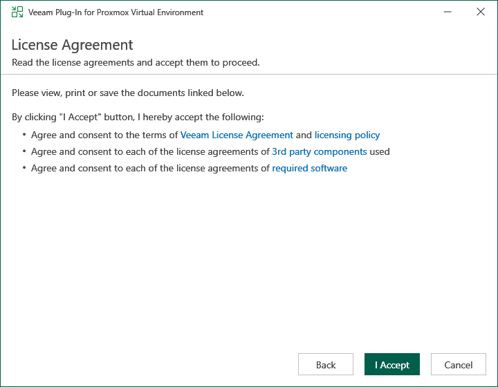
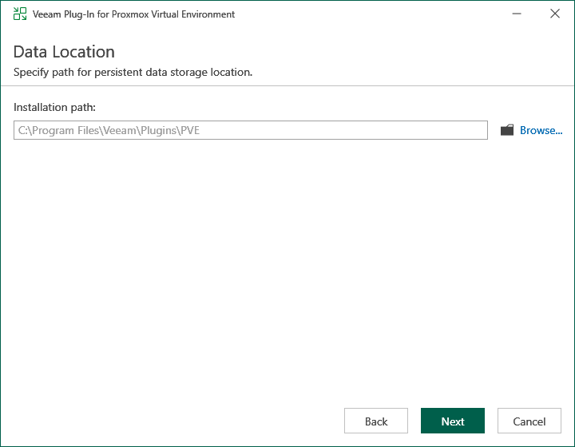
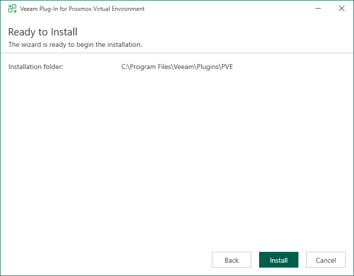

# Installing Veeam Plug-In for Proxmox VE Manually

[This section applies only to Windows-based backup servers]

The pre-installed plug-in that comes with the default installation package of Veeam Backup & Replication allows you to protect Proxmox VE resources. However, you may require to install a new plug-in version on the backup server manually if some updates and patches become available.

|  |
| --- |
| Note |
| If you use a remote Veeam Backup & Replication console, you do not need to install Veeam Plug-in for Proxmox VE on the workstation where the remote Veeam Backup & Replication console is deployed. |

To install Veeam Plug-in for Proxmox VE, do the following:

1. Log in to the backup server using an account with the local Administrator permissions.
2. Download a product installation file from your [Veeam download page](https://www.veeam.com/products/data-platform-trial-download.html?tab=virtualization-plugins).
3. Open the downloaded archive file and launch the installation file.

Before proceeding with installation, the installer will check whether you have Microsoft .NET Core Runtime installed on the backup server. In case the required version is missing, the installer will offer to install it automatically. To do that, click OK.

1. At the License Agreement step of the Veeam Plug-In Plug-in for Proxmox Virtual Environment setup wizard, read and accept both the Veeam license agreement, licensing policy, the 3rd party components and required software license agreement. If you reject the agreements, you will not be able to continue installation.

1. At the Data Location step of the wizard, you can change the installation directory if necessary.

1. At the Ready to Install step of the wizard, click Install to begin installation.

