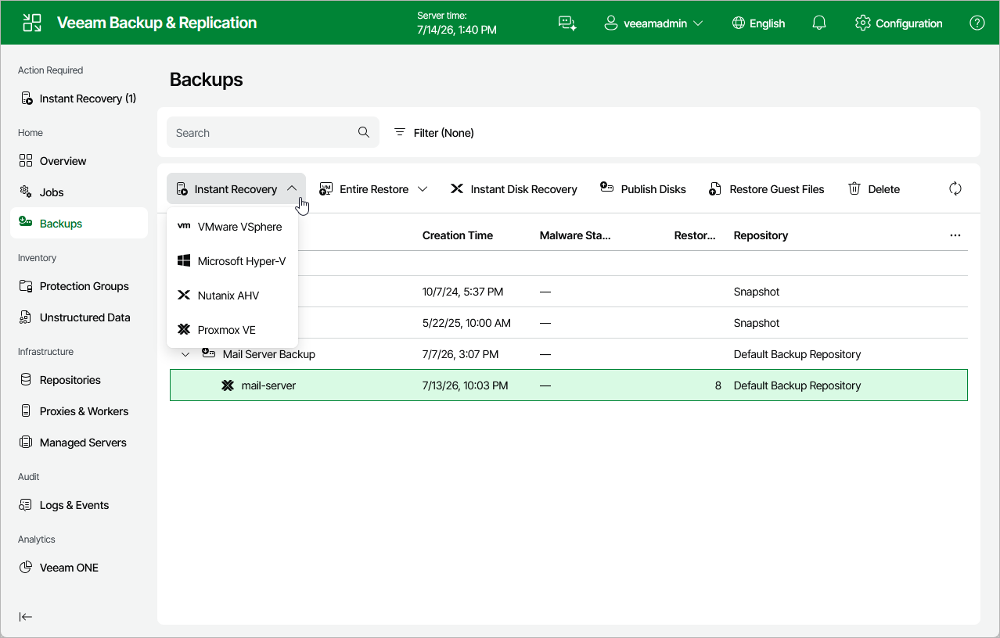

# Performing Instant Recovery of Workloads to Nutanix AHV

To perform Instant Recovery to Nutanix AHV environment, do the following:

1. Navigate to Backups.

1. In the working area, expand the necessary backup job, right-click the VM you want to restore and select Instant recovery.

Alternatively, expand the necessary backup job, select the VM and click Instant Recovery on the ribbon.

1. Complete the Instant Recovery wizard as described in section [Performing Instant VM Recovery of Workloads to Nutanix AHV](ahv_instant_recovery_ahv_web.md).

Page updated 2026-07-27

