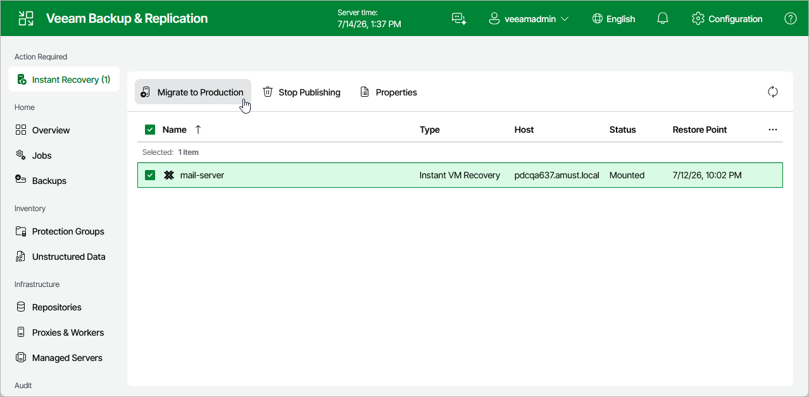

# Step 10. Finalize Instant Recovery

After the VM has been recovered, you can choose whether you want to migrate the VM to the production environment or cancel the recovery operation. When migrating VMs, Veeam Backup & Replication transfers VM disk data to the production storage that you have selected as a destination for the recovered VM.

To finalize the instant recovery operation, do the following:

1. Navigate to Instant Recovery.
2. In the working area, select the VM:

* To transfer VM disk data to the production storage, select Migrate to production.
* To remove the recovered VM, select Stop publishing.

|  |
| --- |
| Important |
| If you stop publishing a VM that was recovered to the same destination where the original VM resided, both the original and recovered VMs will be removed. |

Page updated 2026-07-14

