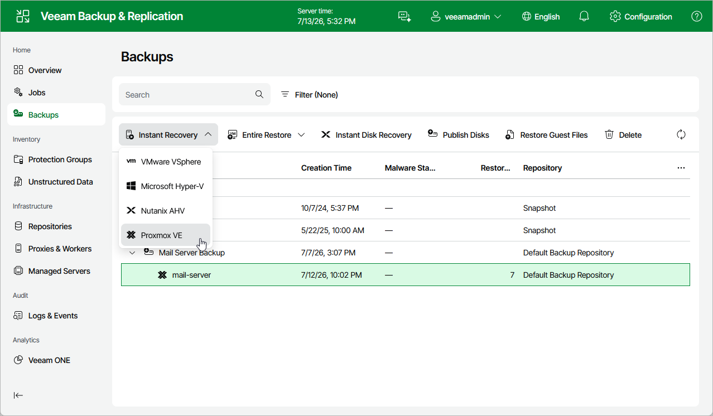

# Step 1. Launch Instant Recovery Wizard

To launch the Instant Recovery to Proxmox VE wizard, do the following:

1. Navigate to Backups.
2. In the working area, expand the necessary backup job, right-click the VM you want to restore and select Instant recovery > Proxmox VE.

Alternatively, expand the necessary backup job, select the VM and click Instant Recovery > Proxmox VE on the menu.

Page updated 2026-07-13

