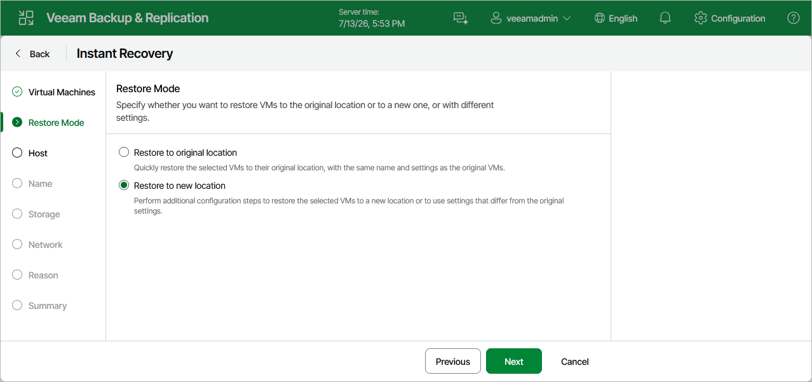

# Step 3. Choose Restore Mode

[This step applies only if you restore Proxmox VE VMs]

At the Restore Mode step of the wizard, choose whether you want to restore the selected VM to the original or to a custom location.

To meet minimum requirements for VMs residing on a cluster, Veeam Backup & Replication allocates 64 MB of RAM to the recovered VM if it originally had less amount of memory.

|  |
| --- |
| Important |
| If you recover a VM with original settings, and the original VM still exists in the virtual infrastructure, the original VM will be removed. |

Page updated 2026-07-13

