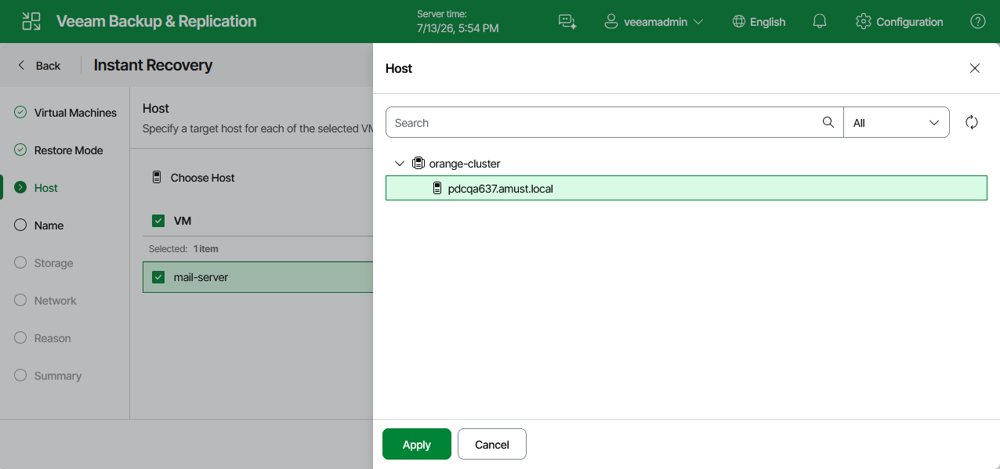

# Step 4. Specify Target Host

At the Host step of the wizard, choose a host where the recovered VM will reside. For a host to be displayed in the list of available hosts, it must be added to the backup infrastructure as described in section [Connecting Proxmox VE Server](pve_connecting_manager.md).

Page updated 2026-07-15

