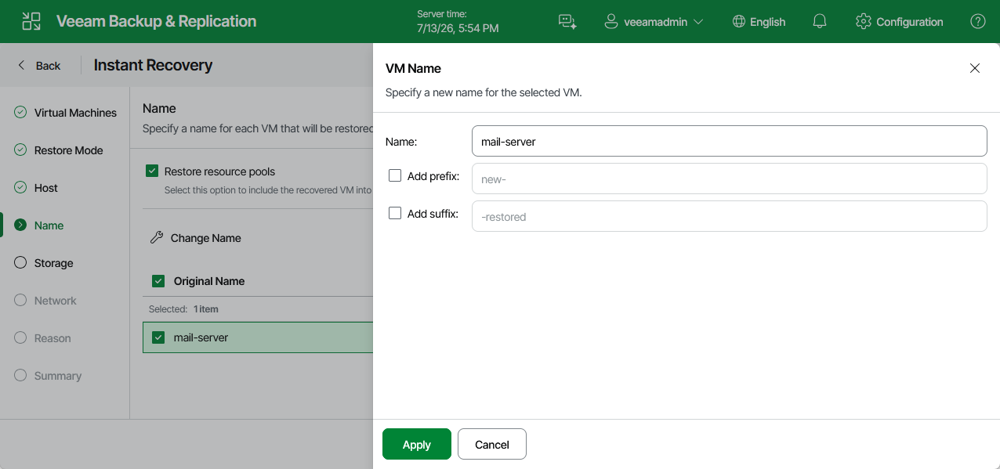

# Step 5. Specify VM Name

At the Name step of the wizard, you can specify a new name for the recovered VM. The maximum length of the name is 63 characters; only the following characters are supported: a-z, A-Z, 0-9, -. The hyphen-minus character (-) is supported, but you cannot use it as the first or the last character of the name.

|  |
| --- |
| Tip |
| You can also choose whether you want the recovered VM to be included into the same resource pool as the original VM. |

Page updated 2026-07-14

