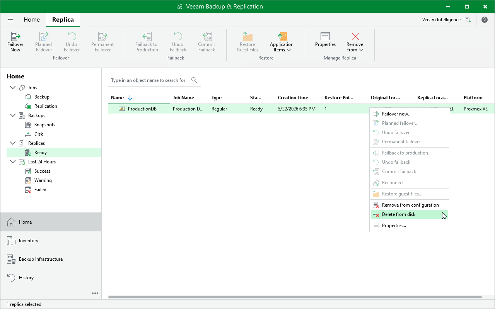

# Deleting Replicas

By default, Veeam Backup & Replication maintains replicas according to retention policy settings saved in the replica metadata. If Veeam Backup & Replication detects that the number of restore points in the replica chain exceeds the allowed number, it automatically removes obsolete snapshots. If you no longer need to protect a VM with its replica, you can either remove replicas from the configuration or delete replicas from disks.

Removing Replicas From Configuration

When you remove replicas from the configuration, Veeam Backup & Replication removes records about the replicas from the configuration database, stops showing the replicas in Veeam Backup & Replication console and also stops synchronizing their state with the state of the source VMs. However, the actual replicas remain on hosts.

|  |
| --- |
| Note |
| Consider the following:   * The Remove from configuration operation can be performed only for VM replicas in the Ready state. If the VM replica is in the Failover or Failback state, this option is disabled. * When you perform the Remove from configuration operation for a VM that is replicated as a standalone object, Veeam Backup & Replication removes this VM from the initial replication job. When you perform the Remove from configuration operation for a VM that is replicated as part of a VM container (host, cluster, folder, resource pool, VirtualApp, datastore or tag), Veeam Backup & Replication adds this VM to the list of exclusions in the initial replication job. |

To remove records about replicas from the Veeam Backup & Replication console and configuration database:

1. Open the Home view.
2. In the inventory pane, click Replicas.
3. In the working area, right-click the necessary replica in the Ready state and select Remove from configuration.

Alternatively, select the replica and click Remove from > Configuration on the ribbon.

Deleting Replicas From Disk

When you delete replicas from disks, Veeam Backup & Replication removes the replicas not only from the Veeam Backup & Replication console and configuration database, but also from the host.

|  |
| --- |
| Note |
| Consider the following:   * You can delete replicas that are in the Ready state. * Do not delete replica files from the host manually; use the Delete from disk option instead. If you delete replica files manually, subsequent replication sessions will fail. * Unlike the Remove from configuration operation, the Delete from disk operation does not remove the processed workload from the initial replication job. This means that the replication process will restart for this workload. To avoid this, you can exclude the workload from the replication job or disable the job. |

To delete a replica, do the following:

1. Open the Home view.
2. In the inventory pane of the Home view, select Replica.
3. In the working area, expand right-click the necessary VM and select Delete from disk.

Alternatively, select the replica and click Remove from > Disk on the ribbon.

Page updated 2026-07-28

