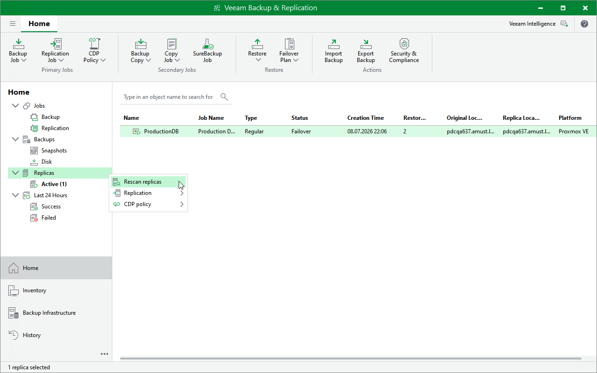

# Rescanning Replicas

Veeam Backup & Replication retrieves information about replicas from the configuration database. If you have manually deleted a restore point from a replica snapshot chain, or observe synchronization errors after you have restored the database, you can instruct Veeam Backup & Replication to check Proxmox VE hosts for replicas and update their state.

To rescan replicas, do the following:

1. Open the Home view.
2. In the inventory pane, right-click the Replicas node and select Rescan Replicas.

Page updated 2026-07-28

