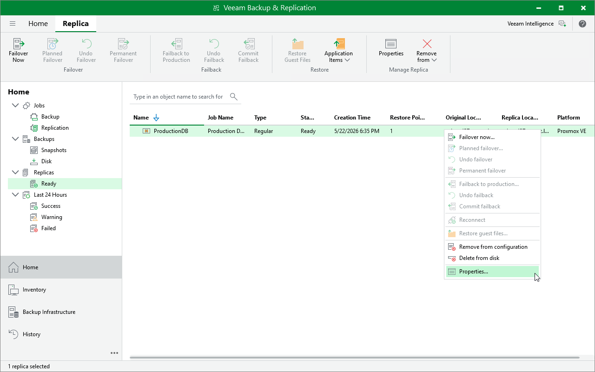

# Viewing Replica Properties

After a replication job successfully creates a VM replica according to the specified schedule, the replica is displayed under the Replica node in the Home view of the Veeam Backup & Replication console. Each replica and the collection of restore points created for this replica is represented with a set of properties, such as:

* Virtual machine — the name of a protected VM.
* Original location — the host where the original VM resides.
* Date — the date when the restore point was created.
* Status — the result of the most recent malware scan performed for the restore point.

|  |
| --- |
| Tip |
| If a restore point is marked as Infected but you know that this point is clean, you can change its status manually. To do that, select the restore point and click Malware > Mark as clean. To learn how to manage infected restore points, see [Managing Malware Status](malware_detection_managing_status.md). |

To view replica properties, do the following:

1. Open the Home view.
2. In the inventory pane, select Replica.
3. In the working area, right-click the necessary replica and select Properties.

Alternatively, select the replica and click Properties on the ribbon.

Page updated 2026-07-15

