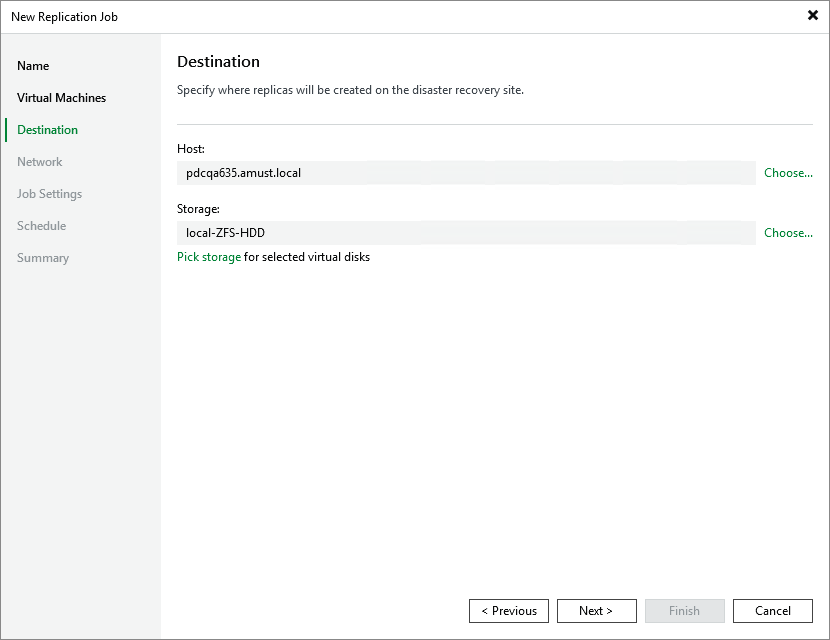

# Step 4. Configure Replication Destination Settings

At the Destination step of the wizard, do the following:

1. Click Choose next to the Host field to specify a host where the VM replica will be launched.
2. Click Choose next to the Storage field to select storage where system files of the VM replica will be stored. For storage to be displayed in the list of available storage, it must be configured in the virtual environment as described in [Proxmox VE documentation](https://pve.proxmox.com/wiki/Storage).

Make sure that the selected storage supports snapshots.

|  |
| --- |
| Tip |
| By default, Veeam Backup & Replication stores all VM replica disks processed by the job in the selected storage. However, you can granularly specify storage for specific virtual disks. To do that, click Pick storage, select a resource from the replication scope and click Storage. |

Page updated 2026-07-21

