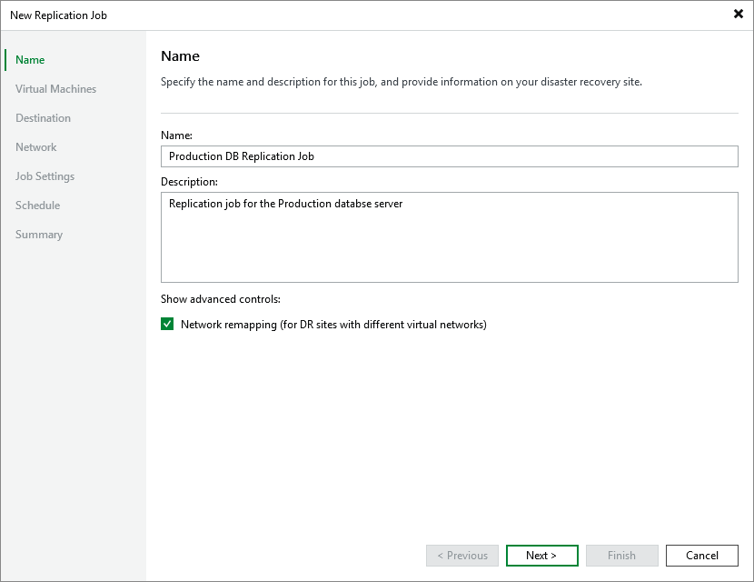

# Step 2. Specify Job Name and Description

At the Name step of the wizard, use the Name and Description fields to specify a name for the new job and to provide a description for future reference. The job name must be unique in Veeam Backup & Replication.

The maximum length of the name is 40 characters; the following characters are not supported: ~ " # % & \* : < > ! ? / \ { | } . ' ` $. The maximum length of the description is 1024 characters.

|  |
| --- |
| Tip |
| By default, replica VMs are connected to the same Proxmox VE networks as the original VMs; if the same networks are not available in the disaster recovery (DR) site, you can create a network mapping table for the site so that the replicas are connected to the correct network. To do that, select the Network remapping (for DR sites with different virtual networks) check box — then, you will be able configure mapping at the Network step.  If the network configuration on your disaster recovery (DR) site differs from the configuration on the production site, select the Network remapping (for DR sites with different virtual networks) check box. In this case, you will be able to instruct Veeam Backup & Replication to update network settings of VM replicas automatically. |

Page updated 2026-07-27

