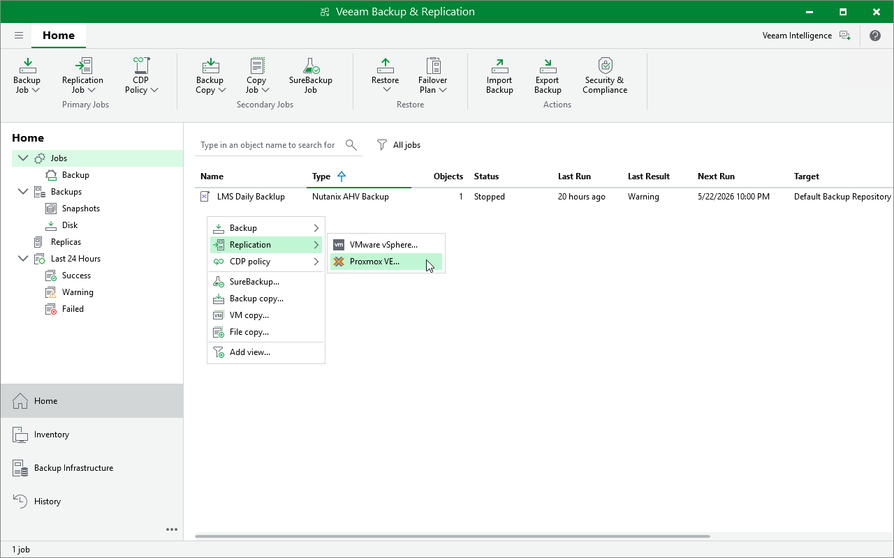

# Step 1. Launch New Replication Job Wizard

To launch the New Job wizard, do the following:

1. Open the Home view.
2. In the inventory pane, select Jobs.

1. Right-click the working area and select Replication > Virtual machine > Proxmox VE.

Alternatively, click Replication Job > Virtual machine on the ribbon.

Page updated 2026-07-20

