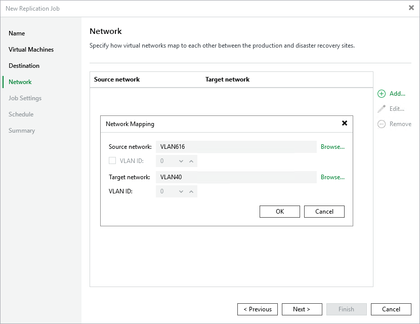

# Step 5. Configure Replication Network Settings

[This step applies only if you have selected the Network remapping check box at the Name step of the wizard]

At the Network step of the wizard, configure a network mapping table.

By default, replica VMs are connected to the same Proxmox VE networks as the original VMs; if the same networks are not available in the disaster recovery (DR) site, you can create a network mapping table for the site so that the replicas are connected to the correct network. When the replication session starts, Veeam Backup & Replication will update replica configuration to replace the production networks with the specified networks in the DR site.

Page updated 2026-06-18

