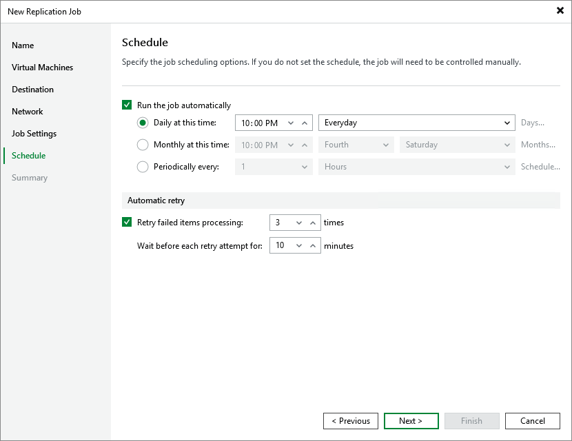

# Step 7. Specify Job Scheduling Options

At the Schedule step of the wizard, you can instruct Veeam Backup & Replication to start the replication job automatically according to a specific schedule. The schedule defines how often the VMs added to the replication job will be replicated.

To help you implement a comprehensive data protection strategy, Veeam Backup & Replication allows you to create schedules of the following types:

* Daily — the replication job will run at a specific time on specific days.

To create a daily schedule for the replication job, select the Daily at this time option and define the exact hour when the job will create restore points. Then, use the drop-down list to choose whether you want the replication job to run every day, on weekdays (Monday through Friday) or on specific days.

* Monthly — the replication job will run at a specific time on specific days of specific months.

To create a monthly schedule for the replication job, select the Monthly at this time option and define the exact hour when the job will create restore points. Then, use the drop-down lists to schedule the specific days and months for the replication job to run.

* Periodically — the replication job will run repeatedly throughout a day with a specific time interval.

To create a periodical schedule for the replication job, select the Periodically every option and define the frequency (in hours or minutes) with which the job will create restore points.

To prevent replication operations from overlapping with production hours, it is recommended that you configure a time interval during which Veeam Backup & Replication is allowed to create restore points; to do that, click Schedule and configure the necessary interval.

|  |
| --- |
| Tip |
| You can instruct Veeam Backup & Replication to run the replication job again if it fails on the first try. To do that, select the Retry failed items processing check box, and specify the maximum number of attempts to run the replication job and the time interval between retries. When retrying replication jobs, Veeam Backup & Replication processes only those VMs that failed to be replicated during the previous attempt. |

Page updated 2026-07-20

