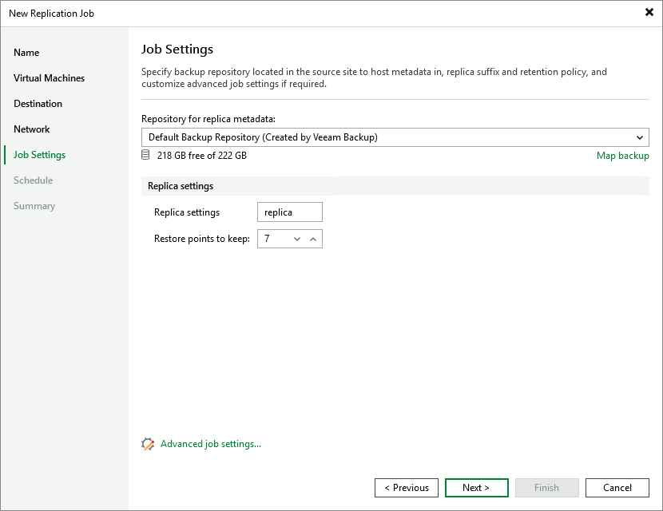

# Step 6. Configure Replication Settings

At the Job Settings step of the wizard, do the following:

1. In the Backup repository drop-down list, select a backup repository where you want to store replica metadata.

For a backup repository to be displayed in the list of available repositories, it must be [added to the backup infrastructure](pve_configure_repository.md).

1. In the Replica settings section, specify a suffix that will be added to the original VM names and choose how long Veeam Backup & Replication will keep restore points in a replica chain. If a restore point is older than the specified limit, Veeam Backup & Replication will remove it from the chain. For more information on how Veeam Backup & Replication tracks and removes redundant restore points, see [Retention Policies](pve_retention_policy.md).

To help you implement a comprehensive replication strategy, Veeam Backup & Replication allows you to [configure advanced job settings](pve_backup_job_create_advanced.md) (such as storage optimization and notification settings).

Page updated 2026-07-21

