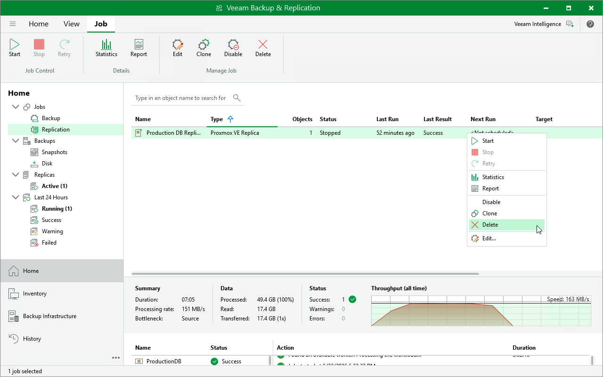

# Deleting Replication Jobs

You can permanently delete a replication job from the Veeam Backup & Replication configuration database if you no longer need it. When you delete a job, replicas created by this job are displayed under the Replicas node in the Home view of the Veeam Backup & Replication console.

To delete a replication job, do the following:

1. Open the Home view.
2. In the inventory pane, select Jobs.
3. In the working area, right-click the necessary job and select Delete.

Alternatively, select the job and click Delete on the ribbon.

.

Page updated 2026-07-20

