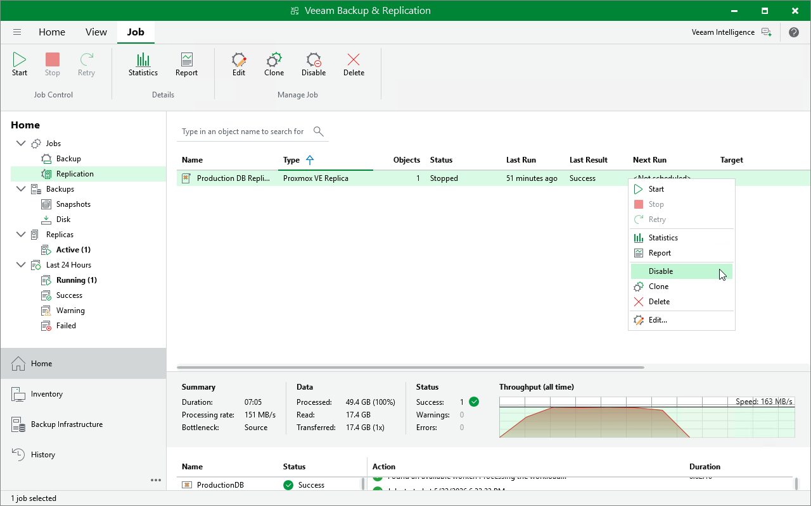

# Disabling and Enabling Replication Jobs

By default, all created jobs run according to the specified schedules. However, you can temporarily disable a job so that it does not run automatically. You will still be able to enable the disabled job at any time you need.

To enable or disable a job, do the following:

1. Open the Home view.
2. In the inventory pane, select Jobs.
3. In the working area, right-click the necessary job and select Disable.

Alternatively, select the job and click Disable on the ribbon.

Page updated 2026-07-20

