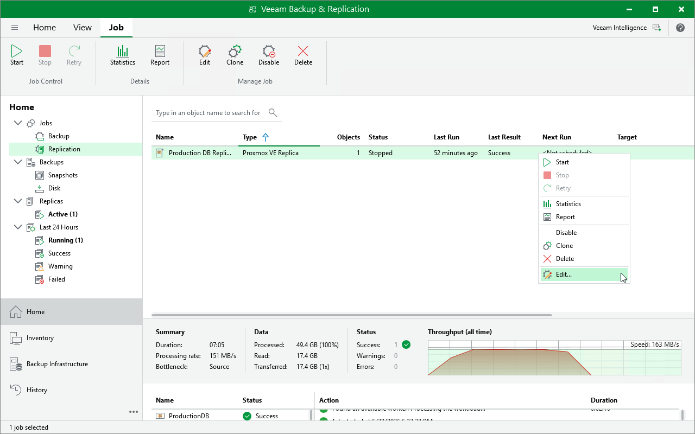

# Editing Replication Jobs

For each backup job, you can modify settings configured while creating the job.

1. Open the Home view.
2. In the inventory pane, select Jobs.
3. In the working area, right-click the job and select Edit.

Alternatively, select the necessary job and click Edit on the ribbon.

1. Complete the Edit Job wizard:

1. To provide a new name and description for the job, follow the instructions provided in section [Creating Replication Jobs](pve_replication_job_create_info.md) (step 2).
2. To edit the replication scope, follow the instructions provided in section [Creating Replication Jobs](pve_replication_job_create_vms.md) (step 3).
3. To change the destination where replicas are stored, follow the instructions provided in section [Creating Replication Jobs](pve_replication_job_create_destination.md) (step 4).
4. To reconfigure network mapping, follow the instructions provided in section [Creating Replication Jobs](pve_replication_job_create_network.md) (step 5).
5. To change the backup repository where replica metadata are stored, to modify job retention settings, to configure storage settings and email notifications, follow the instructions provided in section [Creating Replication Jobs](pve_replication_job_create_settings.md) (step 6).
6. To modify the job schedule and configure automatic retry settings, follow the instructions provided in section [Creating Replication Jobs](pve_replication_job_create_schedule.md) (step 7).
7. At the Summary step of the wizard, review configuration information and click Finish.

Page updated 2026-07-20

